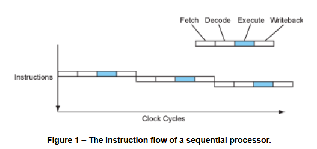
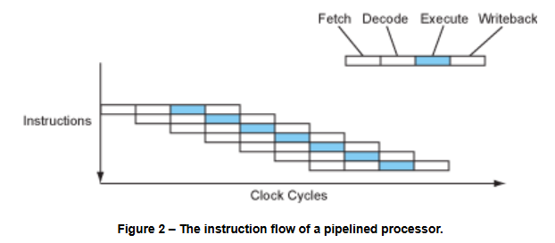
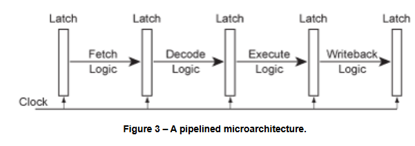
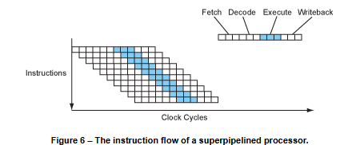
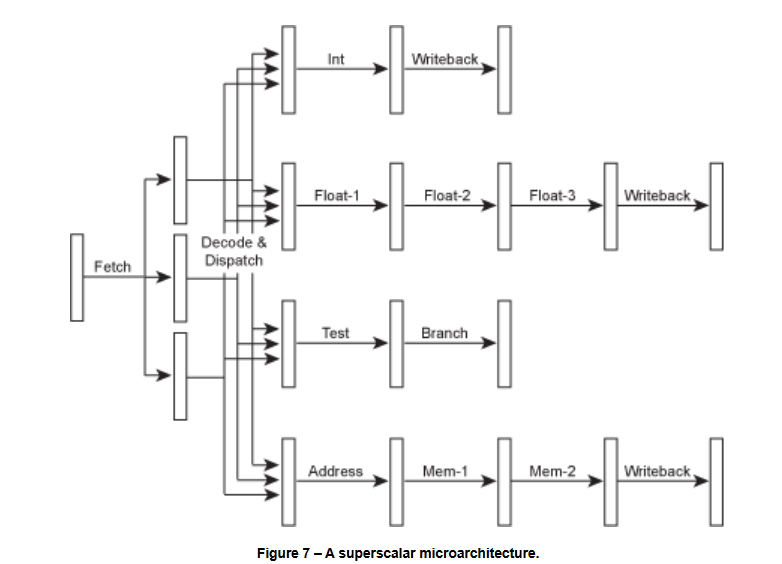

# [More Than Just Megahertz](https://www.lighterra.com/papers/modernmicroprocessors/)

### **Summary of the article "More Than Just Megahertz"**  

#### **The main thesis:**  
**Clock frequency (MHz/GHz) ≠ Processor performance.**  
Different processors with different frequencies may show similar performance, and sometimes an inverse relationship.  

---

### **1. Key observations from the table (1997)**  
| Processor       | Frequency | SPECint95 (integers) | SPECfp95 (real numbers) |
| --------------- | --------- | -------------------- | ----------------------- |
| **MIPS R10000** | 195 MHz   | 11.0                 | 17.0                    |
| **Alpha 21164** | 400 MHz   | 12.3                 | 17.2                    |
| **UltraSPARC**  | 300 MHz   | 12.1                 | 15.5                    |
| **Pentium II**  | 300 MHz   | 11.6                 | 8.8                     |
| **PowerPC G3**  | 300 MHz   | 14.8                 | 11.4                    |
| **IBM POWER2**  | 135 MHz   | 6.2                  | 17.6                    |

#### **Conclusions:**  
1. **Alpha 21164 (400 MHz) vs MIPS R10000 (195 MHz):**  
   - With almost **2× the difference in frequency** – the same indicators (`SPECfp95 ~17`).  
   - Reason: **efficiency of architecture** (number of operations per clock cycle, IPC).  

2. **Pentium II (300 MHz) vs PowerPC G3 (300 MHz):**
- The same frequency, but PowerPC ** is 28% faster** in `SPECint95` (14.8 vs 11.6).
- Pentium II ** loses 2 times** in `SPECfp95` (8.8 vs 17.2 for Alpha) – weak FPU.  

3. **IBM POWER2 (135 MHz):**
- **The lowest frequency**, but **the leader in `SPECfp95`** (17.6) – optimization for floating-point calculations.  
   - The worst result in `SPECint95' (6.2) – the architecture is tailored to scientific tasks.  

---

### **2. Why is clock speed not the main thing?**  
Productivity is determined by the formula:
```
Performance = IPC (Instructions Per Cycle) × Frequency
```  
- **IPC** – how many instructions are executed in one clock cycle.  
- **Frequency** – the number of clock cycles per second.  

#### **Factors affecting IPC:**  
1. **Microarchitecture:**  
   - **Pipelining** (conveyor depth, hazards).  
   - **Superscalarity** (how many instructions are executed in parallel).  
   - **Out-of-Order Execution** (reordering commands).  

2. **Optimization for tasks:**
- **Integer operations** (Pentium II vs PowerPC G3).  
   - **Real operations** (POWER2 – record-breaking FPUs at low frequency).  

3. **Process technology and energy consumption:**
- An increase in frequency can lead to **increased heat dissipation** (the Pentium 4 NetBurst problem).  

---

### **3. Modern examples (2020s)**  
- **Apple M1 (3.2 GHz) vs Intel i9 (5.0 GHz):**
- M1 benefits from **high IPC** (RISC architecture, large cache).  
- **AMD Zen 4 vs Intel Raptor Lake:**  
  - Zen 4 is often slower in frequency, but faster in multithreaded tasks (optimization of cores).  

---

### **Conclusion:**  
**Clock frequency is just one of the parameters.** Modern processors are optimized by:  
- Increased IPC (better architecture).  
- Specializations (AI accelerators, powerful FPUs).  
- Energy efficiency (less GHz, but more work per clock cycle).  

**The 1997 table clearly shows:** Even 25 years ago, frequency was not a direct indicator of speed. Today, the gap between architectures (x86, ARM, RISC-V) makes this principle even more important.  

---
**The key thought:**  
*"Megahertz sells processors, but architecture wins."*








# Deeper Pipelines – Superpipelining



