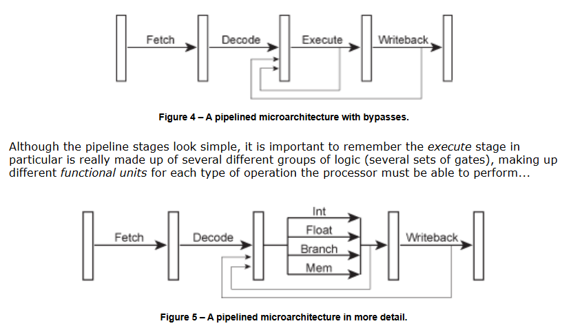

# [More Than Just Megahertz](https://www.lighterra.com/papers/modernmicroprocessors/)

### **Summary of the article "More Than Just Megahertz"**  

#### **The main thesis:**  
**Clock frequency (MHz/GHz) ≠ Processor performance.**  
Different processors with different frequencies may show similar performance, and sometimes an inverse relationship.  

---

### **1. Key observations from the table (1997)**  
| Processor       | Frequency | SPECint95 (integers) | SPECfp95 (real numbers) |
| --------------- | --------- | -------------------- | ----------------------- |
| **MIPS R10000** | 195 MHz   | 11.0                 | 17.0                    |
| **Alpha 21164** | 400 MHz   | 12.3                 | 17.2                    |
| **UltraSPARC**  | 300 MHz   | 12.1                 | 15.5                    |
| **Pentium II**  | 300 MHz   | 11.6                 | 8.8                     |
| **PowerPC G3**  | 300 MHz   | 14.8                 | 11.4                    |
| **IBM POWER2**  | 135 MHz   | 6.2                  | 17.6                    |

#### **Conclusions:**  
1. **Alpha 21164 (400 MHz) vs MIPS R10000 (195 MHz):**  
   - With almost **2× the difference in frequency** – the same indicators (`SPECfp95 ~17`).  
   - Reason: **efficiency of architecture** (number of operations per clock cycle, IPC).  

2. **Pentium II (300 MHz) vs PowerPC G3 (300 MHz):**
- The same frequency, but PowerPC ** is 28% faster** in `SPECint95` (14.8 vs 11.6).
- Pentium II ** loses 2 times** in `SPECfp95` (8.8 vs 17.2 for Alpha) – weak FPU.  

3. **IBM POWER2 (135 MHz):**
- **The lowest frequency**, but **the leader in `SPECfp95`** (17.6) – optimization for floating-point calculations.  
   - The worst result in `SPECint95' (6.2) – the architecture is tailored to scientific tasks.  

---

### **2. Why is clock speed not the main thing?**  
Productivity is determined by the formula:
```
Performance = IPC (Instructions Per Cycle) × Frequency
```  
- **IPC** – how many instructions are executed in one clock cycle.  
- **Frequency** – the number of clock cycles per second.  

#### **Factors affecting IPC:**  
1. **Microarchitecture:**  
   - **Pipelining** (conveyor depth, hazards).  
   - **Superscalarity** (how many instructions are executed in parallel).  
   - **Out-of-Order Execution** (reordering commands).  

2. **Optimization for tasks:**
- **Integer operations** (Pentium II vs PowerPC G3).  
   - **Real operations** (POWER2 – record-breaking FPUs at low frequency).  

3. **Process technology and energy consumption:**
- An increase in frequency can lead to **increased heat dissipation** (the Pentium 4 NetBurst problem).  

---

### **3. Modern examples (2020s)**  
- **Apple M1 (3.2 GHz) vs Intel i9 (5.0 GHz):**
- M1 benefits from **high IPC** (RISC architecture, large cache).  
- **AMD Zen 4 vs Intel Raptor Lake:**  
  - Zen 4 is often slower in frequency, but faster in multithreaded tasks (optimization of cores).  

---

### **Conclusion:**  
**Clock frequency is just one of the parameters.** Modern processors are optimized by:  
- Increased IPC (better architecture).  
- Specializations (AI accelerators, powerful FPUs).  
- Energy efficiency (less GHz, but more work per clock cycle).  

**The 1997 table clearly shows:** Even 25 years ago, frequency was not a direct indicator of speed. Today, the gap between architectures (x86, ARM, RISC-V) makes this principle even more important.  

---
**The key thought:**  
*"Megahertz sells processors, but architecture wins."*

Consider how an instruction is executed – first it is fetched, then decoded, then executed by the appropriate functional unit, and finally the result is written into place. With this scheme, a simple processor might take 4 cycles per instruction (CPI = 4)...

Modern processors overlap these stages in a pipeline, like an assembly line. While one instruction is executing, the next instruction is being decoded, and the one after that is being fetched...


Now the processor is completing 1 instruction every cycle (CPI = 1). This is a four-fold speedup without changing the clock speed at all

### **How Pipelining Achieves 1 Instruction Per Cycle (CPI = 1)**  

Modern processors achieve a **4x speedup** without increasing clock speed by using **instruction pipelining**—a technique that overlaps the execution of multiple instructions, similar to an assembly line.  

---

### **Pipeline Hardware Implementation**  

#### **1. Pipeline Stages & Clock Synchronization**  
Each pipeline stage consists of:  
- **Combinational Logic** (performs the actual computation).  
- **Pipeline Registers (Latches)** that hold intermediate results between stages.  

**How it works:**  
1. A **global clock signal** synchronizes all pipeline latches.  
2. At each clock cycle:  
   - The **input latch** releases its data to the combinational logic.  
   - The logic processes the data **within one clock cycle**.  
   - The result is **captured by the next latch** at the next clock edge.  

➔ This creates a smooth flow where **instructions "move" through the pipeline** like cars on an assembly line.  

---

#### **2. Data Flow in a Pipeline**  
- At the **start of a clock cycle**:  
  - The **current instruction’s state** is stored in a pipeline latch.  
  - This data becomes the **input for the next stage’s logic**.  
- During the **clock cycle**:  
  - Signals propagate through combinational logic (e.g., ALU, decoders).  
  - By the **end of the cycle**, the result is ready for the next latch.  

**Key Constraint:**  
- The **slowest stage** determines the **maximum clock speed** (critical path).  
- If logic takes too long, the clock must slow down (or the pipeline must be redesigned).  

---

### **Visualizing the Pipeline**  

#### **Without Pipelining (CPI = 4)**  
```
|----|----|----|----|  
| IF | ID | EX | WB |  (Instruction 1)  
     | IF | ID | EX | WB |  (Instruction 2)  
          | IF | ID | EX | WB |  (Instruction 3)  
```  
➔ **4 cycles per instruction (CPI = 4).**  

#### **With Pipelining (CPI = 1 in Ideal Case)**  
```
| IF | ID | EX | WB |  
     | IF | ID | EX | WB |  
          | IF | ID | EX | WB |  
               | IF | ID | EX | WB |  
```  
➔ **1 instruction completes per cycle (CPI = 1).**  

---

### **Why This Matters**  
- **Same clock speed, 4x throughput** (in theory).  
- Real-world CPUs use **deeper pipelines** (10+ stages) and **superscalar execution** (multiple instructions per cycle).  
- **Bottlenecks:** Hazards (data/control dependencies) can stall the pipeline.  

**Modern Example:**  
- **Intel’s Sunny Cove (Ice Lake):** ~14-stage pipeline.  
- **Apple M1/M2:** 8-wide decode, 600+ instructions in flight.  

---

### **Key Takeaways**  
✔ **Pipelining enables CPI = 1** by overlapping instruction execution.  
✔ **Clock synchronizes movement** between stages via latches.  
✔ **Combinational logic must finish within 1 cycle** (or the clock slows down).  
✔ **Modern CPUs go beyond simple pipelining** with OoO execution, superscalar designs, and speculative execution.  




# Deeper Pipelines – Superpipelining


