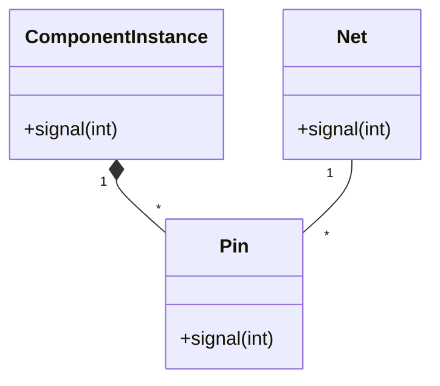

### **Summary: Knowledge Extraction in Domain-Driven Design (Chapter 1)**  

#### **1. Problem: Ignorance of the subject area**  
The author, a software developer, was faced with the task of creating a program for designing **printed circuit boards (PCBs)**, having no knowledge of electronics.  
- **Attempt 1**: Get TK from experts → fail.  
  - Experts have proposed primitive solutions (for example, sorting ASCII files) that do not solve real problems.  
- **Problem**: The gap between technical and substantive knowledge.  

#### **2. The process of "Knowledge Crunching"**  
**Method**: Collaborative modeling through:  
1. **Dialogue with experts**:
- The author drew diagrams (informal UML), the experts corrected them.  
   - Example:
- *Expert*: "These are not chips, but *component instances*."  
     - *Developer*: Clarified the terms (for example, "ref-des" = reference designator = component instance).  
2. **Focusing on a single function**:
- Disassembled **"probe simulation"** — analysis of signal delays in the circuit.  
   - Simplified the model: ignored the physics of the chips, focused on ** the topology of the connections **.  
3. **Iterative refinement of the model**:  
   - **Developer's questions**:
- "How is the signal transmitted beyond the Pin?" → Found out: through * "pushes"* components.  
     - "What counts as a 'hop'?" → Network transition (Net) = 1 hop.  
   - **Result**: A model of objects (Net, Pin, Component) with behavior.  

#### **3. Creating a prototype**  
- **Goal**: To test the model in practice.  
- **Prototype Features**:
- No UI, no persistence, just logic.  
  - Tests + output to the console.  
- **Effect**:
- Experts **saw** the work of the model → the dialogue became more specific.  
  - The code and the model ** evolved together**.  

#### **4. The final model**  
- **Key entities**:
- **Net** (connection).  
  - **Pin** (component contact).  
  - **Component** (the type of component that defines the "jolts" of the signal).  
- **Excluded**:
- Physical parameters of the components (did not affect the task).  
- **Advantages of the** model:
- Eliminated synonyms (for example, "ref-des" = "component instance").  
  - Gave **a single language** for the team.  
  - Allowed new developers to quickly understand the logic.  

#### **5. Lessons**  
1. **A model is born in a dialogue** — you can't just take TK from experts.  
2. **Focus on specific scenarios** — for example, "probe simulation".  
3. **A prototype without "excess"** helps to test ideas quickly.  
4. **The evolution of the model and the code** — they must change together.  

> **Quote**:
> *"A model is a concise knowledge that excludes irrelevant details, but preserves the essence of the problem."*  

#### **Additional concepts**  
- **Ubiquitous Language** is a common language for developers and experts.  
- **Tactical DDD** — Entity (Component), Value Object (Pin), Aggregates.  
- **Iteration** — The model is religion, it can be changed as you learn.  

**Conclusion**: The success of the project depends on ** deep immersion in the domain**, and not only on technology.

## Ingredients of Effective Modeling 
Certain things we did led to the success I just described.

1.  Binding the model and the implementation . That crude prototype forged the essential link 
early, and it was maintained through all subsequent iterations. 

2.  Cultivating a language based on the model . At first, the engineers had to explain 
elementary PCB issues to me, and I had to explain what a class diagram meant. But as the 
project proceeded, any of us could take terms straight out of the model, organize them into 
sentences consistent with the structure of the model, and be un-ambiguously understood 
without translation. 

3.  Developing a knowledge-rich model . The objects had behavior and enforced rules. The 
model wasn't just a data schema; it was integral to solving a complex problem. It captured 
knowledge of various kinds.

4.  Distilling the model . Important concepts were added to the model as it became more 
complete, but equally important, concepts were dropped when they didn't prove useful or 
central. When an unneeded concept was tied to one that was needed, a new model was 
found that distinguished the essential concept so that the other could be dropped. 

5.  Brainstorming and experimenting . The language, combined with sketches and a 
brainstorming attitude, turned our discussions into laboratories of the model, in which 
hundreds of experimental variations could be exercised, tried, and judged. As the team went 
through scenarios, the spoken expressions themselves provided a quick viability test of a 
proposed model, as the ear could quickly detect either the clarity and ease or the 
awkwardness of expression. 

It is the creativity of brainstorming and massive experimentation, leveraged through a model-based 
language and disciplined by the feedback loop through implementation, that makes it possible to 
find a knowledge-rich model and distill it. This kind of knowledge crunching turns the knowledge 
of the team into valuable models.

---

# 🔍 **Knowledge Recycling: An Example of Domain-Driven Design (DDD) in Action**

This case study shows how **Domain-Driven Design** helped bridge the gap between developers and domain experts (PCB design). Here are the key findings:

## 🧩 **Problem and Solution**
- **Challenge**: A developer without electronics knowledge must create software for designing printed circuit boards
- **Breakthrough**: Co-modeling with experts yielded:
- A common language ("nets", "component instances")
- A working domain model
- A prototype that became a "living" document

## 🛠 **How it worked in practice**
1. **Modeling via diagrams**

Experts corrected the developer's diagrams, clarifying the terms:


2. **Focus on specific features**
For example, "probe simulation" for signal delay analysis:
- Signal goes through Net → Pin → Component → Pin → Net...
- Each Net = +1 "hop"
- If hops > 3 → potential problem

3. **Working prototype in days**
Without UI and database, but with:
- Real logic for calculating the signal path
- Tests that check the domain logic

## 💡 **Why did it work?**
1. **Early binding of the model to the code**
The prototype immediately showed how abstractions work in practice.

2. **Model-based language**
Terms like "component instance" became a bridge between teams.

3. **Model = source of knowledge**
Objects didn't just store data - they knew the rules of the domain:
```java
public class Net {
public void signal(int hopCount) {
pins.forEach(pin -> pin.signal(hopCount + 1));
}
}
```

4. **Constant distillation**
Removed unnecessary things (for example, Topology for probe simulation), focusing on the main thing.

5. **Collaborative "crash testing" of ideas**
Hundreds of quick iterations via:
- Discussions
- Sketches
- Object interaction scenarios

## 📚 **Main lessons**
- **Not a waterfall**: Knowledge should circulate between all participants
- **Not "just make a feature"**: Without understanding the domain, the software will be superficial
- **Prototypes > documents**: Working code is better than 100 pages of specifications

> **Methodology**: DDD is not about tools, but about *a culture of shared learning*. As the author said: "Efficient domain modelers are knowledge processors."

Case example:
When experts said "ref-des" and the developer did not understand, this led to a clarification of the term ("the same as component instance") and cleaning up the model language.
