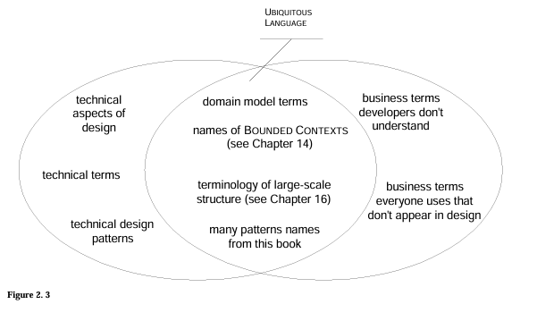
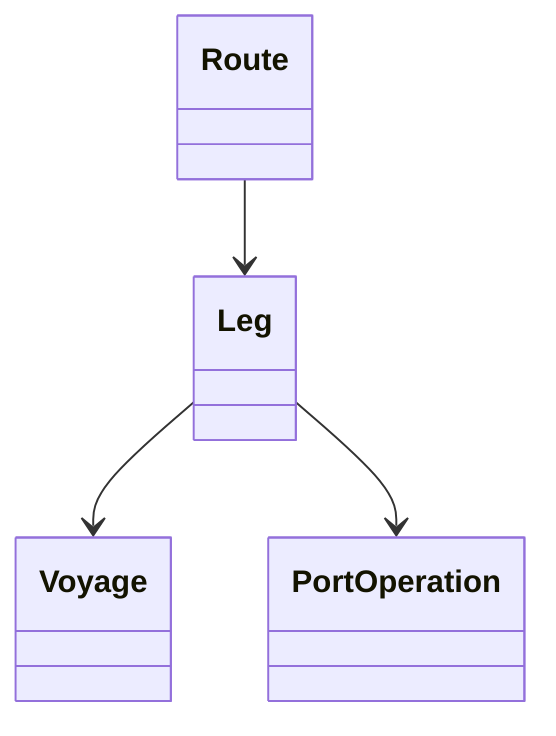
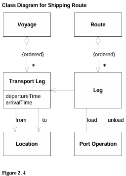
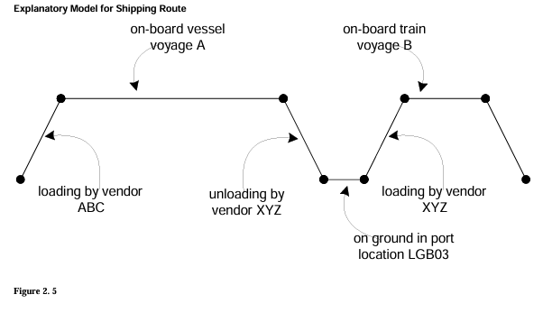

# 📚 **Communication and Use of Language in Software Development**  

The domain model can become **the basis of a common language** for the project. This is a set of concepts that are formed in the minds of the participants, with terms and connections reflecting the understanding of the subject area.  

### 🔹 **Traditional approaches vs. Agile**  
- **Previously,** the emphasis was on text documents and diagrams (for example, UML).  
- **Agile** offers less formal diagrams and lively discussion.  
- **XP (Extreme Programming)** emphasizes **code and tests** as the main means of communication.  

But for any of these approaches to work, you need to **share common concepts and language**!  

---  

## 🌍 **Ubiquitous Language**  


> *"First you write a sentence, then you cut it, mix the pieces, sort them — the order of the phrases doesn't matter!"*  
> — Lewis carroll  

To create a **flexible and knowledge-rich design**, you need:
***A single team language**  
***Experiments with formulations**  

### 🔥 **The problem: The language barrier**  
- **Experts** speak their own jargon.  
- **Developers** either use abstractions that are incomprehensible to experts, or describe the system functionally, but without depth.  
- **Translators** (those who understand both) become **bottlenecks** of information.  

**Consequences:**  
❌ Inaccuracies in understanding  
 Different terms from different people → confusion in the code  
❌ Slow deepening into the subject area  

### 💡 **Solution: Ubiquitous Language**  
- **A model is a language.**
- Classes, methods, patterns are words.  
  - Rules and connections are grammar.  
- **The language must be:**  
  - **One** for all: experts, developers, documentation, and code.  
  - **Flexible** — if the term is unsuccessful, it is changed.  

> **An example from Java:**  
> ```java  
> // Instead of "recalculate the route when changing the customs point"  
> if (routeSpecification.isChanged()) {  
>     itinerary = routingService.calculateNewRoute(routeSpecification);  
> }  
> ```  

---  

# Dialogues: How Ubiquitous Language is changing the discussion**  

### 📍 **Scenario 1: Without a common language**  
**User:** * "If we change the customs point, we need to recalculate the entire route."*  
**Developer:** *"Ok, delete the old entries in the `shipment_table` and recreate them via the `RoutingService`..."*  
➡ **Problem:** They talk about tables and services, not business logic.  

### 📍 **Scenario 2: With Ubiquitous Language**  
**User:** *"If we change the `RouteSpecification`, we need a new `Itinerary`"*  
**Developer:** *"Yes, if the `Itinerary` does not meet the new conditions, we will recalculate it."*  
➡ **Winning:** They speak the language of the model — clearly and without loss of meaning.  

---  

## 📝 **Documents and Diagrams**  

### 📊 **UML is good, but not perfect**  
✔ Helps to visualize the connections between objects.  
❌ Does not convey the **meaning** of objects and their **behavior**.  

**The best approach:**  
- **Minimal diagrams** (only key entities).  
- **Text + diagrams** (not the other way around!).  
- **The code is the main source of truth.**  

### 📄 **Written documents**  
Must:
1. ** Do not duplicate the code** (it is already accurate).  
2. **Be a part of the project** (use Ubiquitous Language).  

> **Example:**  
> Instead of a 50-page TOR, there is a **live glossary of terms** and **usage examples**.  

---  

## 🎨 **Explanatory Models**  

Sometimes ** one model is not enough** — additional ones are needed. ways of explanation.  

### 🚢 **Example: Transportation logistics**  
**Technical model:**  




**Explanatory model:**
``
[Cargo] → [Loading at port A] → [By ship] → [Unloading at port B]  
```  
 Helps beginners understand **how it works in reality**.  

---  

## 🚀 **Conclusions**  
1. **Ubiquitous Language is a must-have.** Without it, there are barriers, errors, and slow development.  
2. **Speak the language of the model** — in code, documents, discussions.  
3. **Documents and diagrams are just things that cannot be expressed in code.**  
4. **Use explanatory models** for training, but do not confuse them with the working model.  

> **Philosophy:**  
> *"Code is design. The language is a bridge between experts and developers."* 💬✨  

