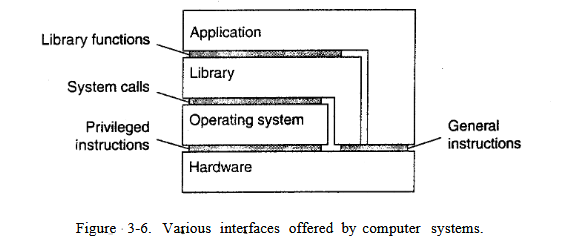
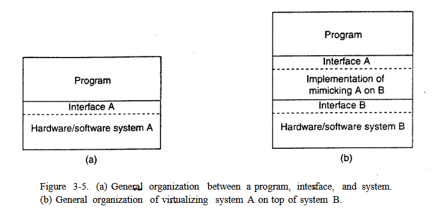

### **Virtualization in distributed systems**  

#### **1. Introduction to Virtualization**  
Virtualization is a technology that allows you to create abstract (virtual) versions of computing resources such as processors, memory, storage, and networks. It provides isolation and parallel execution of multiple processes or operating systems on the same physical hardware.  

- **The illusion of parallelism**: On single-processor systems, virtualization creates the impression of simultaneous task execution by quickly switching between processes.  
- **Resource Virtualization**: Allows you to share and efficiently manage hardware resources between multiple users and applications.  

#### **2. The role of virtualization in distributed systems**  
Virtualization plays a key role in modern distributed systems for several reasons:  

1. **Compatibility with legacy software**
- Allows you to run old applications and operating systems on new hardware.  
   - Example: IBM 370 with support for virtual machines for different operating systems.  

2. **Flexibility and portability**  
   - Virtual machines (VMs) can be easily transferred between physical servers.  
   - Support for dynamic scaling in cloud environments (for example, VM migration between data centers).  

3. **Isolation and Security**
- Each VM operates in an isolated environment, which reduces the risks due to failures or attacks.  
   - Example: VMware and Xen provide secure execution of multiple operating systems on the same server.  

4. **Resource optimization**
- Virtualization allows efficient distribution of computing power between users.  
   - Example: Server virtualization reduces the number of physical machines in a data center.  

#### **3. Virtual Machine Architectures**  
**To understand the differences in virtualization**, it is important to realize that computer systems generally offer four different types of interfaces, at four different levels:

- An interface between the hardware and software, consisting of ma-
chine instructions that can be invoked by any program.
- An interface between the hardware and software, consisting of ma-
chine instructions that can be invoked only by privileged programs,
such as an operating system.
- An interface consisting of system calls as offered by an operating
system.
- An interface consisting of library calls, generally forming what is
known as an application programming interface (API). In many
cases, the aforementioned system calls are hidden by an AP
There are two main approaches to virtualization:  

##### **(a) Process-based virtual machines**  
- Emulate the runtime environment for individual processes.  
- Examples:
- **JVM (Java Virtual Machine)** – interprets Java bytecode.  
  - **WINE** – allows you to run Windows applications on Linux.  
- **Advantages**: The ease of transferring applications between platforms.  
- **Disadvantages**: Limited performance due to interpretation or emulation.  

##### **(b) Virtual Machine Monitors (VMM / Hypervisor)**  
- They allow you to run several full-fledged operating systems on the same hardware.  
- **Types of hypervisors**:
- **Type 1 (hardware)**: They work directly on hardware (VMware ESXi, Xen, Microsoft Hyper-V).  
  - **Type 2 (host)**: Run on top of the OS (VirtualBox, VMware Workstation).  
- **Advantages**: Full isolation, high performance, support for live migration.  

#### **4. Current trends**  
- **Containerization** (Docker, Kubernetes) is a lighter VM alternative that virtualizes only the OS.  
- **Serverless Computing** (Serverless) – automatic scaling without VM management.
- **Hybrid clouds** – a combination of private and public VMs for flexible deployment.  

#### **5. Conclusion**  
Virtualization remains a key technology for distributed systems, providing:
✅ **Compatibility** with legacy applications.  
***Scalability** and efficient use of resources.  
***Security** by isolating environments.  

The future of virtualization is connected with the development of containers, cloud technologies and automated infrastructure management.