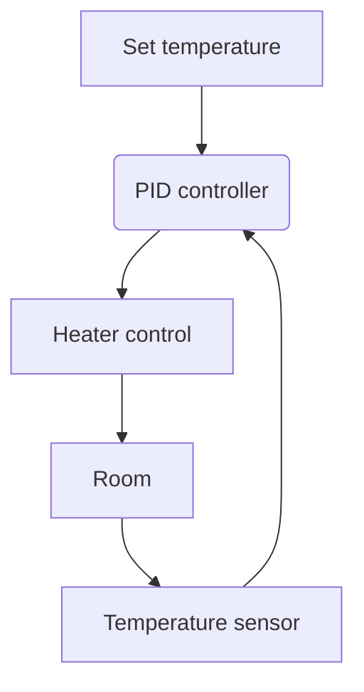

# 🌡️ PID Thermostat Simulator (Java)

**Project of a learning management system with feedback**  
Simulates the operation of a "smart thermostat" with a PID controller algorithm.

## 🎯 Why do we need this project?

1. **Learning objectives**:
- Visual demonstration of feedback control principles
    - The practice of implementing a PID controller
- Working with a dynamic model of the system

2. **Technology stack**:
- Pure Java (without dependencies)
- Object-oriented approach
- "Real-time" model (step-by-step execution)

## 🛠️ How does it work?



## 🚀 Quick Start

1. Clone the repository:
   ```bash
   git clone https://github.com/your-repo/pid-thermostat.git
   ```

2. Assemble and run:
   ```bash
   javac *.java && java Main
   ```

3. Output example:
   ```
   Step 0: 20.00°C
   Step 1: 20.36°C
   ...Step 15: 25.00°C [Goal achieved]
   ```

## 🧩 System components

| Class | Purpose |
|-----------------|-------------------------------------|
| `PIDController` | Implements the regulation algorithm |
| `Room`          | Room model with temperature |
| `Thermostat`    | Control system |
| `Main`          | Entry point and work demonstration |

## ⚙️ Parameter settings

The coefficients can be changed in the PIDController class.:
```java
double Kp = 1.0; // Proportional
double Ki = 0.05; // Integral
double Kd = 0.1; // Differential
```

## Examples of experiments

1. **Coefficient research**:
   ```java
   // Increasing Kp for quick response
   double Kp = 2.0;
   ```

2. **Adding noise**:
   ```java
   // In the Room class:
   externalNoise = (Math.random() - 0.5) * 0.5; // Strong interference
   ```

3. **Overheating test**:
   ```java
   room.setExternalNoise(1.0); // Simulating hot weather
   ```

## 📈 Possible improvements

- [ ] Real-time Visualization (JavaFX)
- [ ] JSON configuration support
- [ ] Multi-room model
- [ ] REST API for management

## 📚 Theory

Basic concepts:
- **P** (Proportional) — reaction to the current error
- **I** (Integral) — elimination of accumulated error
- **D** (Differential) — predicting future deviations

