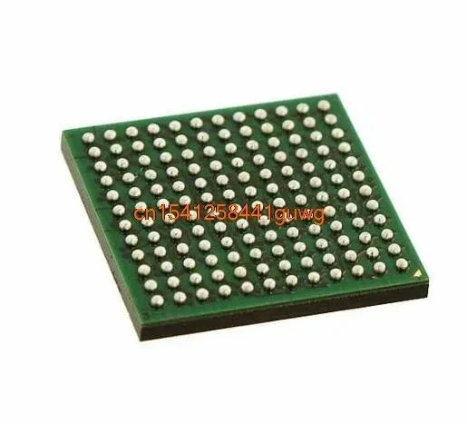

# **1. Physical structure of DDR4 (BGA enclosure)**
DDR4 memory is available in **BGA enclosures** (Ball Grid Array), where each "ball" is a contact for signal, power or ground.  



### **1.1. The location of the balls (Balloon)**
- **x4/x8 chips**: **13 electrical rows** (rows).  
- **x16 chips**: **16 electrical rows**.  
- **There may be non-electric balls between them** (for mechanical support).  

#### **Example for x8 DDR4 (13 electrical rows):**
```
Row 0:  VDD  DQ0  DQ1  VSS  DQ2  DQ3  ...  
Row 1:  A0   A1   BA0  VDDQ A2   A3   ...  
...  
Row 12: CK_t CK_c VSS VDD WE CAS ...
```
(This is a simplified example, the actual wiring is more complicated.)*  

### **1.2. Pitch between balls**
- **Pitch**: **0.8 mm × 0.8 mm** (distance between the centers of the balls).  
- **Depopulated columns**: **3 empty columns** between active ones.  

#### **Why depopulated columns?**  
1. **Reduction of crosstalk** (less mutual influence of signals).  
2. **Easier wiring of PCB** (memory cards).  
3. **Mechanical stability** (less risk of heat damage).  

---

# **2. Electric vs Mechanical balls**
- **Electric balls**: Transmit signals, power (VDD), ground (VSS).  
- **Mechanical balls**: Not connected to anything, only for the rigidity of the body.  

#### **Example in C (abstract BGA model):**
```c
#include <stdint.h>

// Ball type
typedef enum {
    BALL_TYPE_GROUND,   // VSS
    BALL_TYPE_POWER,    // VDD
    BALL_TYPE_SIGNAL, // DQ0, A0, CK_t, etc.
    BALL_TYPE_NC // Not connected (mechanical)
} BallType;

// Description of one balloon
typedef struct {
    uint8_t row; // Row number (0-12 for x8)
uint8_t column; // Column number
    BallType type; // Type
const char *name; // Name of the signal (for example, "DQ0")
} BGABall;

// Example of a BGA description for DDR4 x8
BGABall ddr4_x8_bga[] = {
    {0, 0, BALL_TYPE_POWER, "VDD"},
    {0, 1, BALL_TYPE_SIGNAL, "DQ0"},
    {0, 2, BALL_TYPE_SIGNAL, "DQ1"},
    {0, 3, BALL_TYPE_GROUND, "VSS"},
    {0, 4, BALL_TYPE_SIGNAL, "DQ2"},
    {0, 5, BALL_TYPE_NC, "NC"}, // Empty ball
// ... and so on for all rows
};
```

---

# **3. Why is all this necessary?**
### **3.1. Signal groups in DDR4**
1. **Address lines (A0-A17)**: Bank/row/column selection.  
2. **Data (DQ0-DQ63)**: Data transmission (depends on bus width).  
3. **Control signals (CK_t, CK_c, WE, CAS, RAS)**: Synchronization and commands.  
4. **Power Supply (VDD, VDDQ, VSS)**: Different voltages for core and I/O.  

#### **Example in C: Reading from DDR4 (imitation)**
```c
// Let's assume that we have a function for accessing BGA contacts
void ddr4_send_signal(const char *signal_name, uint32_t value) {
    printf("[DDR4] Set %s = %u\n", signal_name, value);
}

// Reading data from DDR4 (imitation)
uint32_t ddr4_read(uint32_t bank, uint32_t row, uint32_t col) {
    // 1. Activate the line (ACTIVATE)
ddr4_send_signal("A0-A17", row); // Set the address of the line
    ddr4_send_signal("BA0-BA2", bank); // Select a bank
    ddr4_send_signal("RAS", 0); // RAS=0 (string activation)

    // 2. Waiting for tRCD (RAS-to-CAS delay)
delay_nanoseconds(15); // Example: 15 ns

    // 3. Read the column (READ)
ddr4_send_signal("A0-A10", col); // Column address
    ddr4_send_signal("CAS", 0); // CAS=0 (read)

    // 4. Waiting for CL (CAS Latency)
delay_nanoseconds(16); // Example: CL=16 clock cycles

    // 5. We accept data from DQ0-DQn
    uint32_t data = 0;
    for (int i = 0; i < 32; i++) {
data |= (ddr4_read_dq(i) << i); // Reading every bit
    }

    // 6. Close the bank (PRECHARGE)
ddr4_send_signal("RAS", 1);
    ddr4_send_signal("WE", 1);

    return data;
}
```
*(In reality, this is done by the memory controller, but this is how the logic can be modeled.)*  

---

# **4. The difference between x4, x8 and x16**
- **x4**: 4-bit data bus (rare, usually for ECC).  
- **x8**: 8-bit (the most common version).  
- **x16**: 16-bit (for cheaper, but smaller banks).  

#### **Example: Organization of chips on a DIMM module**
- **Regular DDR4-3200 16 GB DIMM**:
- 8 x8 chips (8 bits × 8 chips = 64 bits).  
  - Each chip has **16 banks**.  
- **ECC module**:
- 9 x8 chips (64 bits + 8 bits ECC).  

---

# **5. How does this relate to programming?**
### **5.1. Memory access in C**
Although BGA balls cannot be directly controlled, embedded systems can work with the registers of the memory controller.:  
``c
// Example for ARM (abstract)
volatile uint32_t *ddr4_ctrl = (uint32_t*)0xE0000000; // Controller address

void ddr4_init() {
ddr4_ctrl[0x00] = 0x1; // Enabling DDR4
    ddr4_ctrl[0x04] = 0x3A280; // Setting timings (tCL=14, tRCD=14)
ddr4_ctrl[0x08] = 0x1000; // Setting banks
}
``

### **5.2. Optimizing the code for DDR4**
To use DDR4 efficiently:  
1. **Data alignment** (`alignas(64)` for cache lines).  
2. **Batch read/write** (using burst mode DDR4).  
3. **Avoiding frequent transfers between banks** (bank conflicts).  

```c
#include <stdalign.h>

// Cache line alignment (usually 64 bytes)
alignas(64) uint8_t buffer[1024];

// Batch filling (better for DDR4)
void fill_buffer() {
    for (int i = 0; i < 1024; i += 8) {
        // Writing 8 bytes in one burst
*(uint64_t*)(buffer + i) = 0x1122334455667788;
    }
}
```

---

# **6. Useful materials**
1. **JEDEC DDR4 Standard** ([JESD79-4](https://www.jedec.org/standards-documents/docs/jesd79-4 )) — Official document.
2. **Micron DDR4 Dataset** ([PDF](https://docs.yandex.ru/docs/view?tm=1749034903&tld=ru&lang=en&name=cb-VP9MR8G7224JLLSB.pdf&text=micron.%2F-%2Fmedia%2Fclient%2Fglobal%2Fdocuments%2Fproducts%2Fdata-sheet%2Fdram%2Fddr4%2F8gb_ddr4_sdram.&url=https%3A%2F%2Fwww.micro-semiconductor.com%2Fdatasheet%2Fcb-VP9MR8G7224JLLSB.pdf&lr=213&mime=pdf&l10n=ru&sign=2066e17a74ed814403a5de428a718213&keyno=0&nosw=1&serpParams=tm%3D1749034903%26tld%3Dru%26lang%3Den%26name%3Dcb-VP9MR8G7224JLLSB.pdf%26text%3Dmicron.%2F-%2Fmedia%2Fclient%2Fglobal%2Fdocuments%2Fproducts%2Fdata-sheet%2Fdram%2Fddr4%2F8gb_ddr4_sdram.%26url%3Dhttps%253A%2F%2Fwww.micro-semiconductor.com%2Fdatasheet%2Fcb-VP9MR8G7224JLLSB.pdf%26lr%3D213%26mime%3Dpdf%26l10n%3Dru%26sign%3D2066e17a74ed814403a5de428a718213%26keyno%3D0%26nosw%3D1)) — real BGA templates.  
3. **BGA Routing Guidelines** ([Altera](https://www.intel.com/content/www/us/en/docs/programmable/683082/21-3/pcb-layout-guidelines.html) ) — how to breed DDR4 on the board.  

---

## **Conclusion**
- **BGA DDR4** is a complex grid of balls, where **13 (x4/x8) or 16 (x16) rows** are used for signals, and the rest for mechanics.  
- **Depopulated columns** are needed to reduce interference and simplify wiring.  
- **x4/x8/x16** is the organization of the data bus inside the chip.  
- In real code **, access to DDR4** goes through the memory controller, but understanding the physical structure helps in optimization.

---

# **1. Address lines (A0-A17)**
### **What is it?**  
These are **16-18 bit address lines** (depends on memory density) that indicate:  
- **Row** (Row) in the bank,  
- **Column** (Column) in the row,  
- **Bank number** (Bank).  

### **How does it work?**  
- When the line is activated (**ACTIVATE**), the line number is sent to `A0-A17`.  
- When reading/writing (**READ/WRITE**), the column number is sent to `A0-A10'.  
- Banks are selected by signals **BA0-BA2** (3 bits → up to 8 banks).  

#### **Example in C (imitation):**
```c
// DDR4 address lines (conditional)
uint32_t ddr4_address_lines = 0;

void ddr4_set_row(uint32_t row) {
    ddr4_address_lines = row & 0x1FFFF; // A0-A17 (17 bits)
    printf("Set ROW: 0x%X\n", ddr4_address_lines);
}

void ddr4_set_col(uint32_t col) {
ddr4_address_lines = col & 0x3FF; // A0-A10 (10 bits)
    printf("Set COL: 0x%X\n", ddr4_address_lines);
}
```

---

# **2. Data lines (DQ0-DQ63)**
### **What is it?**  
This is a **data bus** (64 bits for standard DIMM):  
- **DQ0-DQ63** — transmit the data itself.  
- **Data masks (DM, DBI, ECC)** — Recording/error correction management.  

### **How does it work?**  
- Each DDR4 chip has **x4, x8 or x16** DQ lines.  
- On the DIMM module, the chips are combined to produce a 64-bit bus.  

#### **Example in C (writing to DDR4):**
```c
// Writing a 64-bit word to
void ddr4_write(uint64_t addr, uint64_t data) {
    // 1. Activate the line
    ddr4_set_row(addr >> 10);

    // 2. We record the data
    printf("Writing 0x%lX to DQ lines\n", data);

    // 3. We send the WRITE signal
    ddr4_send_command(WRITE);
}
```

---

# **3. Control signals**
### **3.1. Clock signals (CK_t, CK_c)**
- **CK_t** (Clock True) and **CK_c** (Clock Complementary) — differential clock frequency.  
- DDR4 uses **both polarities** for precise synchronization.  

### **3.2. Command signals (RAS, CAS, WE)**
| Signal                         | Description       | Example of the command          |
| ------------------------------ | ----------------- | ------------------------------- |
| **RAS** (Row Access Strobe)    | String activation | `ACTIVATE' (RAS=0, CAS=1, WE=1) |
| **CAS** (Column Access Strobe) | Read/Write column | `READ' (RAS=1, CAS=0, WE=1)     |
| **WE** (Write Enable)          | Write Permission  | `WRITE` (RAS=1, CAS=0, WE=0)    |

#### **Example in C (sending commands):**
```c
void ddr4_send_command(uint8_t cmd) {
    switch (cmd) {
        case ACTIVATE:
            set_pin(RAS, 0); set_pin(CAS, 1); set_pin(WE, 1); break;
        case READ:
            set_pin(RAS, 1); set_pin(CAS, 0); set_pin(WE, 1); break;
        case WRITE:
            set_pin(RAS, 1); set_pin(CAS, 0); set_pin(WE, 0); break;
    }
}
```

---

# **4. Power supply (VDD, VDDQ, VSS)**
### **4.1. Main voltages**
| Signal   | Destination                         | Typical value |
| -------- | ----------------------------------- | ------------- |
| **VDD**  | Memory Core power supply            | 1.2V          |
| **VDDQ** | Power supply of output buffers (DQ) | 1.2 V         |
| **VSS**  | Ground (GND)                        | 0 V           |

### **Why separate VDD and VDDQ?**  
1. **Noise reduction**: Separate power supply for I/O (DQ) and core.  
2. **Stability**: Data buffers do not affect the internal logic.  

#### **Example in C (power control):**
```c
// Abstract voltage setting function
void ddr4_set_voltage() {
set_voltage(VDD, 1.2f); // Core 1.2V
set_voltage(VDDQ, 1.2f); // Buffers 1.2V
}
```

---

# **5. Additional signals**
### **5.1. DMI (Data Mask Inverted)**
- Inverse data mask (to save energy).  

### **5.2. ODT (On-Die Termination)**
- On-chip termination (reduces signal reflections).  

### **5.3. ZQ**
- Calibration of the output resistance.  

---

# **6. Full example of DDR4 operation**
### **6.1. Read sequence**
1. **ACTIVATE** → open the line.  
2. **READ** → read the column.
3. **PRECHARGE** → close the bank.  

#### **C code (imitation):**
```c
uint64_t ddr4_read(uint32_t bank, uint32_t row, uint32_t col) {
// 1. Activating the row
    ddr4_send_command(ACTIVATE);
    ddr4_set_row(row);
    ddr4_set_bank(bank);

    // 2. Reading the column (via tRCD)
delay_ns(15); // tRCD = 15 ns
    ddr4_send_command(READ);
    ddr4_set_col(col);

    // 3. Waiting for CL (CAS Latency)
delay_ns(16); // CL = 16 clock cycles

    // 4. Receiving data
    uint64_t data = read_dq_lines();

    // 5. Closing the bank
    ddr4_send_command(PRECHARGE);
    return data;
}
```

---

# **7. How does this relate to real programming?**
### **7.1. Memory access in Linux**
```c
// mmap for accessing physical memory (example)
int fd = open("/dev/mem", O_RDWR);
void *mem = mmap(NULL, SIZE, PROT_READ|PROT_WRITE, MAP_SHARED, fd, DDR4_BASE_ADDR);

// Read/Write
uint32_t value = *((volatile uint32_t*)mem);
*((volatile uint32_t*)mem) = 0x12345678;
```

### **7.2. Optimization for DDR4**
- **Data alignment** (`alignas(64)`).  
- **Burst access** (reading blocks of 64 bytes each).  
- **Avoiding bank conflicts** (switching banks adds delays).  

---

# **Conclusion**
- **Address lines (A0-A17)** — select a memory location.  
- **Data (DQ0-DQ63)** — transmission of information.  
- **Control signals (RAS/CAS/WE)** — Memory commands.  
- **Power Supply (VDD/VDDQ/VSS)** — separate for core and I/O.  

This is the **basic DDR4 logic** that the memory controller uses "under the hood". In real code, you don't control these signals directly (the controller does), but understanding the principles helps with optimization.

**Banks in DDR4** are a key part of the memory architecture that directly affects performance. Let's figure out in detail what it is, why it is needed and how it works.  

---

# **1. What is a Bank in DDR4?**  
**Bank** is an independent memory block inside a DDR4 chip that can be activated and processed **in parallel** with other banks.  

### **The office analogy:**
- **The entire DDR4 chip** is a multi—storey office.  
- **Bank** — a separate floor (for example, 16 floors = 16 banks).  
- **Row (Row)** — a room on the floor.  
- **Column** is a drawer in the room.  

To get the data:  
1. Choose the ** floor (bank)** → `BA0-BA2`.  
2. You open the ** room (row)** → `A0-A17`.  
3. You take the ** box (column)** → `A0-A10`.  

---

# **2. Why do we need banks?**  
### **2.1. Parallelism**  
- You can **activate different banks at the same time** (but not one row in the same bank twice without closing).  
- While one bank is processing the command, the other can start a new operation.  

### **2.2. Reducing delays**  
- If the data is distributed across banks, you can avoid **tRC** (Row Cycle Time) — the time between row activations in one bank.  

### **2.3. Work efficiency**  
- The memory controller can **switch between banks** while others are waiting for updates (**tRAS**, **tRP**).  

---

# **3. How many banks are in DDR4?**  
- **Regular DDR4 chip**: **16 banks** (there were 8 in DDR3).
- **Each bank** has its own row and column matrix.  

#### **An example for a DDR4 x8 chip:**
- **Banks**: 16 (addressable via `BA0-BA3`).  
- **Lines**: Up To **65536 (2^16)** per bank (depends on the density).  
- **Columns**: Up To **1024 (2^10)** per line.  

---

# **4. How is the bank selected?**  
### **4.1. Bank selection signals**  
- **BA0-BA2 (Bank Address)**: 3 bits → 8 banks (in DDR4 sometimes **BA0-BA3** for 16 banks).  
- **BG0-BG1 (Bank Group)**: 2 bits → 4 bank groups (speeds up access).  

#### **Example in C (bank selection):**
```c
void ddr4_activate_bank(uint8_t bank_group, uint8_t bank) {
// Installing BG0-BG1 and BA0-BA2
    uint8_t bg_bits = bank_group & 0x3; // 2 bits
    uint8_t ba_bits = bank & 0x7; // 3 bits
    printf("Select Bank Group: %u, Bank: %u\n", bg_bits, ba_bits);
}
```

### **4.2. Bank Groups**  
DDR4 introduces **Bank Groups** for even more parallelism:  
- **4 groups** (BG0-BG1).  
- There are 4 banks in each group** (BA0-BA1).  
- You can activate rows ** in different groups almost simultaneously**.  

---

# **5. An example of working with banks**  
### **5.1. The sequence of operations**  
1. **ACTIVATE** → open row in bank 1.
2. **READ** → read column.
3. **ACTIVATE** → open row in bank 2 (**without waiting for tRP!**).  

#### **C code (imitation):**
```c
void ddr4_read_two_banks() {
    // 1. Activate row 42 in bank 1
    ddr4_activate_bank(0, 1); // Group 0, Bank 1
    ddr4_set_row(42);

    // 2. Read column 100
    ddr4_send_command(READ);
    ddr4_set_col(100);
    uint64_t data1 = read_dq_lines();

    // 3. Activate line 24 in bank 2 (in parallel!)
    ddr4_activate_bank(0, 2); // Group 0, Bank 2
    ddr4_set_row(24);

    // 4. Read column 200
    ddr4_send_command(READ);
    ddr4_set_col(200);
    uint64_t data2 = read_dq_lines();
}
```

---

# **6. Bank Conflicts**  
### **6.1. What is it?**  
If two requests go **to the same bank**, but **have different lines**, a conflict occurs:  
- You must first close the old line (**PRECHARGE**).  
- Wait For **tRP** (Row Precharge Time).  
- Only then open a new one.  

### **6.2. How to avoid it?**  
-**Distribute data across different banks**.  
- Use **Bank Groups**.  

#### **Example of a conflict:**
```c
// Bad: both requests to bank 1
ddr4_activate_bank(0, 1); ddr4_set_row(10); // Request 1
ddr4_activate_bank(0, 1); ddr4_set_row(20); // Request 2 (waiting for tRP!)

// Ok: different banks
ddr4_activate_bank(0, 1); ddr4_set_row(10); // Request 1
ddr4_activate_bank(0, 2); ddr4_set_row(20); // Request 2 (in parallel!)
```

---

# **7. How do banks affect productivity?**  
### **7.1. Burst access**  
DDR4 reads data ** in bursts** of 8 words (64 bytes). If the data is stored in the same bank:  
- The first word has a delay **tRCD + CL**.  
- The rest go in a row without delay.  

### **7.2. Optimization in programming**  
- **Alignment of structures** to match the size of the cache line (64 bytes).  
- **Localization of data** in one bank for burst access.  

#### **Example in C:**
```c
// Burst DDR4 alignment
struct __attribute__((aligned(64))) DataBlock {
    uint64_t data[8]; // 64 bytes
};

// Filling out the burst package
DataBlock block;
for (int i = 0; i < 8; i++) {
block.data[i] = i; // DDR4 will transfer this in one burst
}
``

---

# **8. Useful materials**  
1. **JEDEC DDR4 Standard** ([JESD79-4](https://www.jedec.org/standards-documents/docs/jesd79-4 )) — section about banks.  
2. **Micron DDR4 Dataset** ([PDF](https://www.micron.com/-/media/client/global/documents/products/data-sheet/dram/ddr4/8gb_ddr4_sdram.pdf) ) — pages 30-35.
3. **Architecture of memory controllers** — books on CPU design (for example, "Memory Systems: Cache, DRAM, Disk").  

---

# **Conclusion**  
- **A bank in DDR4** is an independent block of memory that allows parallel processing of requests.  
- **16 banks** in DDR4 versus 8 in DDR3 is one of the reasons for the performance increase.  
- **Bank Groups** accelerate access even more.  
- **Banking conflicts** are the main enemy of productivity (avoid them!).