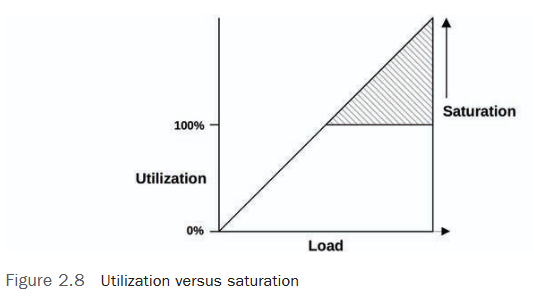

# 🚀 **Disposal and Saturation: How can I understand the system load?**  

## 📊 **2.3.11 Utilization**  



Utilization is an indicator of how busy a resource (CPU, disk, network, etc.) is. But there are **two approaches** to measuring it.:  

### ⏱️ **1. Temporary disposal (Time-Based)**  
It is defined as **the fraction of time when the resource was occupied**:
``
U = B/T  
``
- **B** is the time when the resource was running.  
- **T** is the total observation time.  

🔹 **Examples**:
- **CPU**: `%us` and `%sy` in `top` or `%CPU` in `htop'.  
- **Disk**: `%util` in `iostat` (shows how often the disk was occupied).  

⚠️ **Important**:
> 100% utilization ** does not always** mean that the system cannot handle more requests!  
 For example, the disk can buffer requests in the cache, and the CPU can execute threads in parallel.  

### 📦 **2. Disposal by capacity (Capacity-Based)**  
Shows **how close the resource is to the limit** of its bandwidth.  

🔹 **Example**:
- **The elevator** 🏢 can be **100% occupied** (carrying people non-stop), but if it is **not full**, it can take more passengers.  
- **Disk** may be **100% busy**, but if it has a free cache, it will be able to process additional requests.  

💡 **Conclusion**:  
> **100% busy ≠ 100% capacity**  

---

## 🚦 **2.3.12 Saturation**  

Saturation is when the system ** fails** to handle the load and starts **forming queues**.  

📌 **Key points**:  
- Starts at **100% capacity-based disposal**.  
- Leads to **increased latency**.  
- May occur **earlier than 100% time-based utilization** if the resource can process tasks in parallel.  

📈 **Schedule "Recycling vs. Saturation"**:
- Up to 100% utilization — the system copes.  
- After 100%— the **linear growth of queues** and delays begins.  

🔹 **Real-life example**:
> Imagine a cafe ☕:
> — **Disposal** - how long does the barista take to make coffee.  
> - **Saturation** — when the queue gets so long that people leave.  

---

## 🔍 **2.3.13 Profiling**  

Profiling helps you understand **where resources** (CPU, memory, disk) are going.  

### 📊 **Profiling methods**:
1. **Sampling** (Sampling)  
   - The system periodically "photographs" the state (for example, the call stack in the CPU).  
   - The more frequent the samples, the more accurate the data.  

2. **Tracing
- Records **each event** (for example, system calls).  
   - Gives more details, but creates a load.  

🔹 **An example of CPU profiling in Java**:  
```java
# Using async-profiler for sampling./profiler.sh
-d 10 -f flamegraph.html <PID>
``
*(Result is [FlameGraph](http://www.brendangregg.com/flamegraphs.html ), which shows which methods consume CPU.)*  

---

## 💡 **Results**  
- **Disposal** — "how busy" the resource is.  
- **Saturation** — "how overloaded".  
- **Profiling** is a tool for finding bottlenecks.