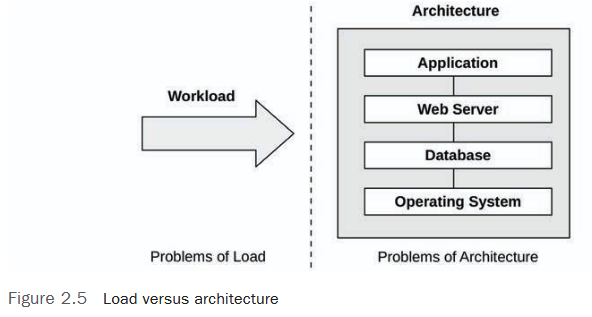
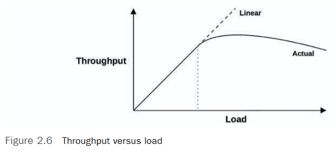
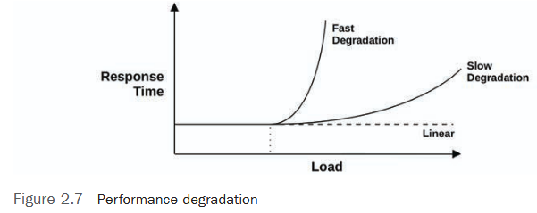

# 🚀 **Performance: Load, Architecture, and Metrics**  

## 📊 **2.3.8 Load vs. Architecture**  

The application may slow down for two main reasons:  

1. **Architecture problems** 🏗️
- Suboptimal software/hardware configuration.  
   - Bottlenecks: for example, a single-threaded application that does not use all the CPU.  
   - Locks: A multi-threaded application where threads wait for a single lock.  

   *Java example*:
``java
   synchronized (this) { // <- All threads are waiting for this lock!
       // Critical Section
   }
   ```  


2. **Load problems** ⚖️  
   - The system just can't handle the volume of requests.  
   - Cloud solution: autoscaling (add more servers!).  

   *Example*:
> If all CPUs are loaded at 100%, and requests are still in the queue, the problem is **load**, not the architecture.  

---

## 📈 **2.3.9 Scalability**  


How does the system behave under increasing load?  

### 🔹 **Typical throughput schedule (Throughput vs. Load)**  
- **Linear growth** 📏 → the system is coping.  
- **"Knee point"** (knee point) 🦵 → competition for resources begins.  
- **Performance drop** 📉 → The overhead of synchronization outweighs the benefits.  

*Example*:
> Adding threads to the CPU-bound application. At first, the speed increases, but after 100% CPU usage, frequent context switches begin, and real work is performed slower.  

### 🔹 **Degradation of response time**  
- **Rapid degradation** ⚡ (for example, when running out of memory and swapping to disk). 
> Swapping is the process by which the operating system moves data from RAM to a hard disk (or SSD) and vice versa. 
- **Slow degradation** 🐢 (for example, under CPU load).  
- **Linear growth** ↔️ (if the system returns errors instead of a queue, for example, HTTP 503).  
> **Linear error growth (503) = load growth = the system does not scale.**

**Why are there errors instead of queues?**

* The queue may overload the system.
* "Fail fast": it is better to report the problem immediately.
* The system may be poorly designed for queues.


---

## 📏 **2.3.10 Performance Metrics**  

Key metrics for analysis:  

| Metric          | Usage example                         |
| --------------- | ------------------------------------- |
| **Throughput**  | Requests/sec (DB), Mbit/sec (Network) |
| **IOPS**        | I/O operations per second             |
| **Utilization** | % of CPU/disk/Network usage           |
| **Latency**     | Response time (avg, p90, p99)         |

### ⚠️ **Problems with metrics**  
- **Overhead** 🔄: Collecting metrics consumes resources too!  
- **Errors** 🐞: Metrics may become outdated or count incorrectly (especially after software updates).  

*Tip*: Always check **exactly how** metrics are calculated in your system!