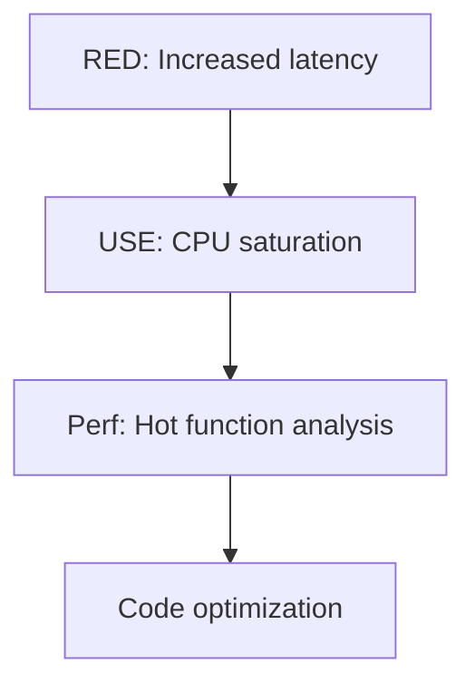

# The scientific Method in Performance Analysis: a complete guide

# The basic principles of the scientific method

The scientific method in performance analysis includes 5 key steps:

1. **Formulation of the question** - A clear definition of the performance problem
2. **Hypothesizing** - An assumption about the possible cause of the problem
3. **Forecasting** is the expected result if the hypothesis is correct
4. **Testing** - Hypothesis testing (observational or experimental)
5. **Analysis** - Interpretation of results and conclusions

## 📊 Application examples

### Example 1: Observational Testing (Slow DB Queries)
```markdown
1. Question: Why are database queries slow?
2. Hypothesis: "Noisy neighbors" in the cloud create competition for disk I/O
3. Forecast: Measurements will show high file system latency
4. Test:
# We measure the latency of the file system
   strace -T -e trace=file -p <db_pid> 2>&1 | grep "time="
5. Analysis: FS is responsible for <5% delay → hypothesis was not confirmed
```

### Example 2: Experimental Testing (HTTP Latency)
```bash
# Before the change:
curl -o /dev/null -s -w "%{time_total}\n" http://hostC
# 0.45 sec

# After transferring hostA:
curl -o /dev/null -s -w "%{time_total}\n" http://hostC
# 0.02 sec → hypothesis confirmed
```

## 🔄 Diagnostic cycle

An ongoing refinement process:
```
Hypothesis → Instrumentation → Data → New hypothesis
```

**Key Features:**
- Fast iterations (15-30 minutes per cycle)
- Capture of all hypotheses and results
- Use of "red tests" (intentional deterioration)

# The method of tools: pros and cons

### Advantages
```markdown
- [x] Quick start analysis
- [x] Standardization in the team
- [x] Identifying obvious problems
```

### Risks
```markdown
- [ ] The "lantern effect" (analyzing only known areas)
- [ ] The paradox of choice (too many tools)
- [ ] Skipping complex problems that require custom solutions
```

# Optimal work strategy

1. **Start with the scientific method**:
- Formulate clear hypotheses
- Conduct controlled experiments

2. **Use the diagnostic cycle** for complex problems:
```mermaid
   graph LR
       A[High CPU Usage] --> B{Hypothesis: A problem in the code}
       B --> C[Checking perf]
       C --> D{Data: No anomalies}
       D --> E[New hypothesis: The problem is in IO-wait]
   ```

3. **Supplement with the instrumental method**:
- Create a checklist of the main metrics
   - Gradually expand the set of tools

## 💡 Professional advice

1. **For complex systems**:
```bash
   # Combination of tools:
perf stat -e cache-misses,dTLB-load-misses \
   -p $(pgrep -f my_service)
   ```

2. **Document the process**:
```markdown
   ## Hypothesis 2023-05-01
   - Assumption: High latency due to GC
- Test: jstat -gcutil <pid> 1s
   - Result: GC <2% → not confirmed
   ```

3. **Automate data collection**:
```python
   # Script for collecting basic metrics
   while True:
       collect_cpu_metrics()
       collect_memory_stats()
       time.sleep(60)
   ```

# 🚀 **A complete guide to USE and RED methods for performance Analysis**

## 🔍 **USE method: identification of system bottlenecks**

### * **What are we checking?**
For each resource, we analyze:
1. **Utilization** - resource download
2. **Saturation** - task queue
3. **Errors** - number of failures

### 💻 **Examples of metrics for Linux**

#### **CPU**
```bash
# Utilization
mpstat -P ALL 1

# Saturation (queue length)
vmstat 1 # column 'r'

# Errors (hardware)
dmesg | grep -i cpu
```

#### **Memory**
```bash
# Utilization
free -m

# Saturation (swapping)
sar -B 1

# Errors (OOM)
dmesg | grep -i "out of memory"
```

#### **Disks**
```bash
# Utilization
iostat -x 1

# Saturation (queue)
iostat -xn 1 # column 'avgqu-sz'

# Errors
smartctl -a /dev/sda | grep -i error
```

### 📊 **Interpretation of results**
| Resource | Problematic indicator       | Possible cause    |
| -------- | --------------------------- | ----------------- |
| CPU      | Utilization >70% per 1 core | Suboptimal code   |
| Memory   | Saturation >0 (swapping)    | Lack of RAM       |
| Network  | Errors >0                   | Hardware problems |

## 📈 **RED method: service monitoring**

### **Three key metrics:**
1. **Rate (RPS)** - number of requests
2. **Errors** - number of errors
3. **Duration** - execution time

### 🛠 **Implementation in microservice architecture**

#### **Prometheus + Grafana**
```yaml
# Prometheus config for collecting
scrape_configs RED metrics:
  - job_name: 'web_service'
    metrics_path: '/metrics'
    static_configs:
      - targets: ['web:8080']
```

**Grafana Dashboard:**
- **Rate**: `sum(rate(http_requests_total[1m])) by (service)`
- **Errors**: `sum(rate(http_requests_failed_total[1m])) by (service)`
- **Duration**: `histogram_quantile(0.99, sum(rate(http_request_duration_seconds_bucket[1m])) by (le, service))`

### 🔥 **An example of a problematic scenario**

**Symptoms:**
- Rate: 1500 → 2000 RPS (+33%)
- Errors: 5 → 150 per minute
- Duration p99: 50ms → 1200ms

**Diagnostics:**
1. USE-method → High utilization of databases
2. A lock was found in SQL: `SELECT FOR UPDATE`
3. Optimization → Replacement with optimistic locks

## 🧩 **Combining USE and RED**

### **The sequence of analysis:**
1. **RED** shows a problematic service
2. **USE** identifies a specific resource
3. **Deep analysis** (profiling)



## 💡 **Practical advice**

1. **Automate the collection of USE metrics**:
```bash
   # Script for quick verification
#!/bin/bash
   echo "CPU:"
   mpstat -P ALL 1 1 | tail -n +5
   echo "Memory:"
   free -m
   echo "Disk:"
   iostat -x 1 2 | tail -n +7
   ```

2. **Set up alerts**:
   ```yaml
   # Alertmanager config
   - alert: HighCPUSaturation
     expr: avg(irate(node_cpu_seconds_total{mode="idle"}[1m])) < 0.2
     for: 5m
   ```

3. **Use distributed tracing**:
```java
// Example with Jaeger
   @Tracing
   public Response processRequest(Request req) {
       try (Scope scope = tracer.buildSpan("process").startActive(true)) {
           // Processing logic
       }
   }
   ```

## 📊 **Case study: API Optimization**

**Problem**: p99 latency >1s at 500 RPS  
**Analysis**:
1. **RED**: High duration with stable rate
2. **USE**: Low CPU utilization, but high disk saturation
3. **Fix**: Replacing HDD with SSD → p99 <100ms