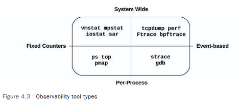
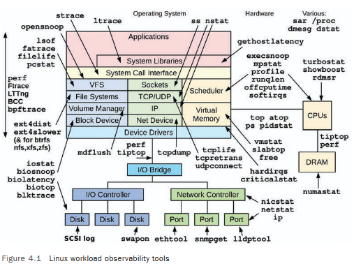
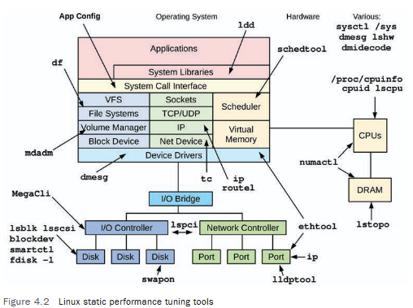

 

# 🖥️ Глава 4: Инструменты наблюдаемости (Observability Tools)

Операционные системы исторически предоставляли множество инструментов для наблюдения за системным программным обеспечением и аппаратными компонентами. 🧐 Для новичка широкий спектр доступных инструментов и метрик наводил на мысль, что можно наблюдать **всё** — или, по крайней мере, всё важное. На **самом деле** существовало много пробелов, и эксперты по производительности систем стали мастерами в искусстве **умозаключений и интерпретации**: они определяли активность по косвенным инструментам и статистике.

**Например:** 📨
*   Сетевые пакеты можно было исследовать по отдельности (`sniffing`), а вот дисковый ввод-вывод — нет (по крайней мере, нелегко).

Наблюдаемость в Linux **значительно улучшилась** благодаря появлению инструментов динамической трассировки, включая основанные на **BPF** `BCC` и `bpftrace`. Теперь освещены даже тёмные углы, включая отдельные операции дискового I/O с помощью `biosnoop(8)`. 💡

Однако многие компании и коммерческие продукты мониторинга еще не приняли на вооружение системную трассировку и упускают те преимущества, которые она дает. Я возглавил это движение, разрабатывая, публикуя и объясняя новые инструменты трассировки, которые уже используются такими компаниями, как **Netflix** и **Facebook**. 👍.

---

## 4.1 Покрытие инструментов

На Рисунке 4.1 показана диаграмма операционной системы, которую я аннотировал инструментами наблюдаемости рабочей нагрузки Linux, относящимися к каждому компоненту.


> Figure 4.1 shows an operating system diagram that I have annotated with the Linux workload observability tools1 relevant to each component.

Большинство этих инструментов сосредоточены на определенном ресурсе, таком как ЦП, память или диски, и рассматриваются в соответствующей главе. Существуют также мульти-инструменты, которые могут анализировать многие области, и они представлены позже в этой главе: `perf`, `Ftrace`, `BCC` и `bpftrace`.

### 4.1.1 Статические инструменты производительности

Существует еще один тип наблюдаемости, который исследует атрибуты системы в состоянии покоя, а не под активной нагрузкой. Это было описано как методология **статической настройки производительности** в Главе 2, и эти инструменты показаны на Рисунке 4.2.




> Remember to use the tools in Figure 4.2 to check for issues with configuration and components.Sometimes performance issues are simply due to a misconfiguration.

### 4.1.2 Инструменты для кризисных ситуаций

Когда у вас возникает **кризис производительности** в production-окружении, для отладки которого требуются различные инструменты, вы можете обнаружить, что ни один из них не установлен. Хуже того, поскольку сервер испытывает проблемы с производительностью, установка инструментов может занять гораздо больше времени, чем обычно, затягивая кризис. 🚨

Для Linux в Таблице 4.1 перечислены рекомендуемые пакеты для установки или исходные репозитории, которые предоставляют эти инструменты для кризисных ситуаций. В таблице показаны имена пакетов для Ubuntu/Debian (эти имена могут отличаться для разных дистрибутивов Linux).

**📋 Таблица 4.1 Пакеты с инструментами для кризисных ситуаций в Linux**

| Пакет                                     | Предоставляет                                                                                                                                                                                                                                                                             |
| :---------------------------------------- | :---------------------------------------------------------------------------------------------------------------------------------------------------------------------------------------------------------------------------------------------------------------------------------------- |
| `procps`                                  | `ps(1)`, `vmstat(8)`, `uptime(1)`, `top(1)`                                                                                                                                                                                                                                               |
| `util-linux`                              | `dmesg(1)`, `lsblk(1)`, `lscpu(1)`                                                                                                                                                                                                                                                        |
| `sysstat`                                 | `iostat(1)`, `mpstat(1)`, `pidstat(1)`, `sar(1)`                                                                                                                                                                                                                                          |
| `iproute2`                                | `ip(8)`, `ss(8)`, `nstat(8)`, `tc(8)`                                                                                                                                                                                                                                                     |
| `numactl`                                 | `numastat(8)`                                                                                                                                                                                                                                                                             |
| `linux-tools-common`                      | `linux-tools-\$(uname -r)` `perf(1)`, `turbostat(8)`                                                                                                                                                                                                                                      |
| `bcc-tools` (aka `bpfcc-tools`)           | `opensnoop(8)`, `execsnoop(8)`, `runqlat(8)`, `runqlen(8)`, `softirqs(8)`, `hardirqs(8)`, `ext4slower(8)`, `ext4dist(8)`, `biotop(8)`, `biosnoop(8)`, `biolatency(8)`, `tcptop(8)`, `tcplife(8)`, `trace(8)`, `argdist(8)`, `funccount(8)`, `stackcount(8)`, `profile(8)` и многие другие |
| `bpftrace`                                | `bpftrace`, базовые версии `opensnoop(8)`, `execsnoop(8)`, `runqlat(8)`, `runqlen(8)`, `biosnoop(8)`, `biolatency(8)` и другие                                                                                                                                                            |
| `perf-tools-unstable`                     | Ftrace-версии `opensnoop(8)`, `execsnoop(8)`, `iolatency(8)`, `iosnoop(8)`, `bitesize(8)`, `funccount(8)`, `kprobe(8)`                                                                                                                                                                    |
| `trace-cmd`                               | `trace-cmd(1)`                                                                                                                                                                                                                                                                            |
| `nicstat`                                 | `nicstat(1)`                                                                                                                                                                                                                                                                              |
| `ethtool`                                 | `ethtool(8)`                                                                                                                                                                                                                                                                              |
| `tiptop`                                  | `tiptop(1)`                                                                                                                                                                                                                                                                               |
| `msr-tools`                               | `rdmsr(8)`, `wrmsr(8)`                                                                                                                                                                                                                                                                    |
| `github.com/brendangregg/msr-cloud-tools` | `showboost(8)`, `cpuhot(8)`, `cputemp(8)`                                                                                                                                                                                                                                                 |
| `github.com/brendangregg/pmc-cloud-tools` | `pmcarch(8)`, `cpucache(8)`, `icache(8)`, `tlbstat(8)`, `resstalls(8)`                                                                                                                                                                                                                    |

Крупные компании, такие как **Netflix**, имеют команды по ОС и производительности, которые следят за тем, чтобы в production-системах были установлены **все эти пакеты**. В стандартном дистрибутиве Linux могут быть установлены только `procps` и `util-linux`, поэтому все остальные необходимо добавить. 📦

В контейнерных средах может быть желательно создать привилегированный контейнер для отладки, который имеет полный доступ к системе и все установленные инструменты. Образ этого контейнера можно установить на хостах и развертывать при необходимости.

> **Важное замечание:** 🔧 Добавления пакетов с инструментами часто **недостаточно**: ядро и пользовательское программное обеспечение также可能需要 быть настроено для поддержки этих инструментов. Инструментам трассировки обычно требуются определенные опции конфигурации ядра (например, `CONFIG_FTRACE` и `CONFIG_BPF`). Инструментам профилирования обычно требуется, чтобы программное обеспечение было настроено для поддержки построения стека вызовов. Если ваша компания еще этого не сделала, вам следует **проверить работу каждого инструмента** и исправить те, которые не работают, *до* того, как они срочно понадобятся в кризисной ситуации.

Следующие разделы более подробно объясняют инструменты наблюдаемости производительности.

---

## 4.2 Типы инструментов

Полезной категоризацией для инструментов наблюдаемости является то, предоставляют ли они **общесистемную** или **постпроцессную** наблюдаемость, и основаны ли они на **счетчиках** или **событиях**. Эти атрибуты показаны на Рисунке 4.3 вместе с примерами инструментов Linux.

**📈 Рисунок 4.3 Типы инструментов наблюдаемости**

Некоторые инструменты попадают более чем в один квадрант; например, `top(1)` также имеет общесистемную сводку, а общесистемные инструменты на основе событий часто могут фильтровать по определенному процессу (`-p PID`).

Инструменты на основе событий включают профилировщики и трассировщики. **Профилировщики** наблюдают за активностью, делая серию снимков (сэмплов) по событиям, создавая общую картину цели. **Трассировщики** инструментируют каждое интересующее событие и могут выполнять их обработку, например, для генерации пользовательских счетчиков. Счетчики, трассировка и профилирование были введены в Главе 1.

Следующие разделы описывают инструменты Linux, которые используют фиксированные счетчики, трассировку и профилирование, а также те, которые выполняют мониторинг (метрики).

### 4.2.1 Фиксированные счетчики

Ядра поддерживают различные счетчики для предоставления системной статистики. Обычно они реализованы как целые беззнаковые числа, которые увеличиваются при наступлении событий.

**Например в C:** 🧪
```c
// Упрощенная концептуальная модель
unsigned long long disk_writes; // Счетчик записи на диск
unsigned long long time_in_disk_io; // Общее время, проведенное в операциях I/O

// При завершении операции записи:
disk_writes++;
time_in_disk_io += (io_end_time - io_start_time);
```

Например, существуют счетчики для количества полученных сетевых пакетов, выполненных операций дискового I/O и произошедших прерываний. Они предоставляются программным обеспечением мониторинга в виде метрик.

Общим подходом в ядре является ведение пары **кумулятивных счетчиков**: один для подсчета событий, а другой для записи общего времени события. Они предоставляют непосредственное количество событий и среднее время (или задержку) события, путем деления общего времени на количество. Поскольку они кумулятивные, считывая пару с интервалом (например, одна секунда), можно вычислить дельту, а из нее — количество в секунду и среднюю задержку. Именно так рассчитывается множество системных статистик.

С точки зрения производительности, счетчики считаются **«бесплатными»** для использования, поскольку они включены по умолчанию и постоянно поддерживаются ядром. Единственная дополнительная стоимость при их использовании — это act считывания их значений из пользовательского пространства (который должен быть незначительным). Следующие примеры инструментов считывают эти общесистемные или постпроцессные данные.

**Общесистемные**

Эти инструменты исследуют общесистемную активность в контексте системного программного обеспечения или аппаратных ресурсов, используя счетчики ядра. Инструменты Linux включают:

*   `vmstat(8)`: Статистика виртуальной и физической памяти, общесистемная.
*   `mpstat(1)`: Загрузка каждого ЦП.
*   `iostat(1)`: Использование дискового I/O для каждого диска.
*   `nstat(8)`: Статистика стека TCP/IP.
*   `sar(1)`: Различная статистика; также может архивировать ее для исторических отчетов.

Эти инструменты обычно доступны для просмотра всем пользователям системы (не-рут). Их статистика также часто строится в виде графиков программным обеспечением мониторинга.

Многие следуют соглашению об использовании, когда они принимают необязательные интервал и счетчик, например, `vmstat(8)` с интервалом в одну секунду и количеством выводов, равным трем:

```bash
$ vmstat 1 3
procs -----------memory---------- ---swap-- -----io---- -system-- ------cpu-----
 r  b   swpd   free   buff  cache   si   so    bi    bo   in   cs us sy id wa st
 4  0 1446428 662012 142100 5644676   1    4    28   152   33    1 29  8 63  0  0
 4  0 1446428 665988 142116 5642272   0    0     0   284 4957 4969 51  0 48  0  0
 4  0 1446428 685116 142116 5623676   0    0     0     0 4488 5507 52  0 48  0  0
```

> **Примечание:** 📝 Первая строка вывода — это сводка с момента загрузки, которая показывает средние значения за все время работы системы. Последующие строки — это сводки за указанный интервал, показывающие текущую активность. По крайней мере, такова цель: в этой версии Linux первая строка смешивает сводку с момента загрузки и текущие значения (`vmstat(8)` объясняется в Главе 7).

**Постпроцессные**

Эти инструменты ориентированы на процессы и используют счетчики, которые ядро ведет для каждого процесса. Инструменты Linux включают:

*   `ps(1)`: Показывает статус процесса, различные статистики процесса, включая использование памяти и ЦП.
*   `top(1)`: Показывает "топ" процессов, отсортированных по использованию ЦП или другой статистике.
*   `pmap(1)`: Выводит список сегментов памяти процесса со статистикой использования.

Эти инструменты обычно читают статистику из файловой системы `/proc`.

### 4.2.2 Профилирование

**Профилирование** характеризует цель путем сбора набора **сэмплов** или снимков ее поведения. Использование ЦП — распространенная цель профилирования, где сэмплы по таймеру берутся от указателя инструкции или трассировки стека, чтобы охарактеризовать пути кода, потребляющие ЦП. Эти сэмплы обычно собираются с фиксированной частотой, например, 100 Гц (циклов в секунду) на всех ЦП, и в течение короткого периода, например, одной минуты. Инструменты профилирования часто используют 99 Гц вместо 100 Гц, чтобы избежать синхронизации с активностью цели, что может привести к завышению или занижению подсчетов.

Профилирование также может быть основано на не привязанных к таймеру аппаратных событиях, таких как промахи кэша ЦП или активность шины. Это может показать, какие пути кода ответственны за это, — информация, которая может особенно помочь разработчикам оптимизировать их код для использования памяти.

В отличие от фиксированных счетчиков, профилирование (и трассировка) обычно включаются только **по мере необходимости**, поскольку они могут требовать некоторых ресурсов ЦП для сбора и дискового пространства для хранения. Величина этих нагрузок зависит от инструмента и частоты событий, которые он инструментирует. Профилировщики на основе таймера обычно **безопаснее**: частота событий известна, поэтому их нагрузку можно предсказать, и частоту событий можно выбрать так, чтобы нагрузка была незначительной.

**Общесистемные**

Общесистемные профилировщики Linux включают:

*   `perf(1)`: Стандартный профилировщик Linux, который включает подкоманды для профилирования.
*   `profile(8)`: Профилировщик ЦП на основе BPF из репозитория BCC, который подсчитывает частоту трассировок стека в контексте ядра.
*   **Intel VTune Amplifier XE**: Профилирование для Linux и Windows, с графическим интерфейсом, включая просмотр исходного кода.

Их также можно использовать для targeting одного процесса.

**Постпроцессные**

Профилировщики, ориентированные на процессы, включают:

*   `gprof(1)`: Инструмент профилирования GNU, который анализирует информацию профилирования, добавленную компиляторами (например, `gcc -pg`).
*   `cachegrind`: Инструмент из набора `valgrind`, может профилировать использование аппаратного кэша (и многое другое) и визуализировать профили с помощью `kcachegrind`.
*   **Java Flight Recorder (JFR)**: Языки программирования часто имеют свои собственные специализированные профилировщики, которые могут проверять контекст языка. Например, JFR для Java.

Смотрите Главу 6 (ЦП) и Главу 13 (`perf`) для получения дополнительной информации об инструментах профилирования.

### 4.2.3 Трассировка

**Трассировка** инструментирует **каждое** происшествие события и может сохранять детали, основанные на событиях, для последующего анализа или производить сводку. Это похоже на профилирование, но цель — собрать или исследовать **все события**, а не просто сэмпл. Трассировка может привести к **более высоким** нагрузкам на ЦП и хранилище, чем профилирование, что может замедлить цель трассировки. Это следует принимать во внимание, так как это может негативно повлиять на рабочую нагрузку в production, а измеренные временные метки также могут быть искажены трассировщиком. Как и профилирование, трассировка обычно используется только по мере необходимости.

**Логирование**, когда нечастые события, такие как ошибки и предупреждения, записываются в файл журнала для последующего чтения, можно рассматривать как **низкочастотную трассировку**, которая включена по умолчанию. Логи включают системный журнал (`syslog`).

Ниже приведены примеры инструментов трассировки для всей системы и для отдельных процессов.

**Общесистемные**

Эти инструменты трассировки исследуют общесистемную активность в контексте системного программного обеспечения или аппаратных ресурсов, используя средства трассировки ядра. Инструменты Linux включают:

*   `tcpdump(8)`: Трассировка сетевых пакетов (использует `libpcap`).
*   `biosnoop(8)`: Трассировка блочного I/O (использует BCC или bpftrace).
*   `execsnoop(8)`: Трассировка новых процессов (использует BCC или bpftrace).
*   `perf(1)`: Стандартный профилировщик Linux, также может трассировать события.
*   `perf trace`: Специальная подкоманда `perf`, которая трассирует системные вызовы общесистемно.
*   `Ftrace`: Встроенный в Linux трассировщик.
*   `BCC`: Библиотека и набор инструментов для трассировки на основе BPF.
*   `bpftrace`: Трассировщик на основе BPF (`bpftrace(8)`) и набор инструментов.

`perf(1)`, `Ftrace`, `BCC` и `bpftrace` представлены в Разделе 4.5, а подробно рассмотрены в Главах 13–15. Существует **более ста** инструментов трассировки, построенных с использованием BCC и bpftrace, включая `biosnoop(8)` и `execsnoop(8)` из этого списка. Дополнительные примеры приведены throughout этой книги.

**Постпроцессные**

Эти инструменты трассировки ориентированы на процессы, как и frameworks операционной системы, на которых они основаны. Инструменты Linux включают:

*   `strace(1)`: Трассировка системных вызовов.
*   `gdb(1)`: Отладчик на уровне исходного кода.

Отладчики могут исследовать данные по каждому событию, но они должны делать это, останавливая и запуская выполнение цели. Это может сопровождаться **огромной** нагрузкой, что делает их непригодными для использования в production-средах.

Общесистемные инструменты трассировки, такие как `perf(1)` и `bpftrace`, поддерживают фильтры для изучения одного процесса и могут работать с гораздо **меньшей нагрузкой**, что делает их предпочтительными, где это возможно.

### 4.2.4 Мониторинг

Мониторинг был представлен в Главе 2. В отличие от типов инструментов, рассмотренных ранее, мониторинг **непрерывно записывает** статистику на случай, если она позже понадобится.

**`sar(1)`**

Традиционным инструментом для мониторинга одного хоста ОС является **System Activity Reporter**, `sar(1)`, происходящий из AT&T Unix. `sar(1)` основан на счетчиках и имеет агента, который выполняется по расписанию (через `cron`), чтобы записывать состояние общесистемных счетчиков. `sar(1)` позволяет просматривать их в командной строке, например:

```bash
# sar
Linux 4.15.0-66-generic (bgregg) 12/21/2019 _x86_64_ (8 CPU)
12:00:01 AM     CPU     %user     %nice   %system   %iowait    %steal     %idle
12:05:01 AM     all      3.34      0.00      0.95      0.04      0.00     95.66
12:10:01 AM     all      2.93      0.00      0.87      0.04      0.00     96.16
12:15:01 AM     all      3.05      0.00      1.38      0.18      0.00     95.40
12:20:01 AM     all      3.02      0.00      0.88      0.03      0.00     96.06
[...]
Average:        all      0.00      0.00      0.00      0.00      0.00      0.00
```

По умолчанию `sar(1)` читает свой архив статистики (если он включен), чтобы вывести последнюю историческую статистику. Вы можете указать необязательные интервал и счетчик, чтобы исследовать текущую активность с указанной скоростью. `sar(1)` может записывать **десятки** различных статистик, чтобы дать представление о ЦП, памяти, дисках, сети, прерываниях, потреблении энергии и многом другом. Он подробно рассматривается в Разделе 4.4.

Сторонние продукты мониторинга часто строятся на основе `sar(1)` или той же статистики наблюдаемости, которую он использует, и предоставляют эти метрики по сети.

**SNMP**

Традиционной технологией для сетевого мониторинга является **Simple Network Management Protocol (SNMP)**. Устройства и операционные системы могут поддерживать SNMP и в некоторых случаях предоставлять его по умолчанию, что позволяет избежать установки сторонних агентов или экспортеров. SNMP включает многие базовые метрики ОС, хотя он не был расширен для покрытия современных приложений. Большинство сред переключаются на пользовательский мониторинг на основе агентов.

**Агенты**

Современное программное обеспечение для мониторинга запускает **агентов** (также известных как экспортеры или плагины) на каждой системе для записи метрик ядра и приложений. Они могут включать агентов для конкретных приложений и целей, например, для сервера баз данных MySQL, веб-сервера Apache и системы кэширования Memcached. Такие агенты могут предоставлять детальные метрики запросов приложений, которые недоступны только из системных счетчиков.

Программное обеспечение мониторинга и агенты для Linux включают:

*   **Performance Co-Pilot (PCP)**: PCP поддерживает dozens различных агентов (называемых Performance Metric Domain Agents: PMDAs), включая метрики на основе BPF.
*   **Prometheus**: Программное обеспечение Prometheus поддерживает dozens различных экспортеров для баз данных, оборудования, обмена сообщениями, хранилищ, HTTP, API и логирования.
*   **collectd**: Поддерживает dozens различных плагинов.

**Пример архитектуры мониторинга** изображен на Рисунке 4.4, включая сервер базы данных мониторинга для архивирования метрик и веб-сервер мониторинга для предоставления клиентского UI. Метрики отправляются (или становятся доступными) агентами на сервер базы данных, а затем предоставляются клиентским UI для отображения в виде линейных графиков и в дашбордах.

**🏗️ Рисунок 4.4 Пример архитектуры мониторинга**

Существуют dozens продуктов мониторинга и hundreds различных агентов для разных типов целей. Их охват выходит за рамки этой книги. Однако здесь рассматривается один общий знаменатель: **системная статистика** (основанная на счетчиках ядра). Системная статистика, отображаемая продуктами мониторинга, обычно **та же самая**, что и отображаемая системными инструментами: `vmstat(8)`, `iostat(1)` и т.д. Изучение этих инструментов поможет вам понять продукты мониторинга, даже если вы никогда не используете инструменты командной строки. Эти инструменты рассматриваются в последующих главах.

Некоторые продукты мониторинга читают свои системные метрики, запуская системные инструменты и анализируя текстовый вывод, что неэффективно. Лучшие продукты мониторинга используют библиотечные и kernel-интерфейсы для прямого чтения метрик — те же интерфейсы, которые используются инструментами командной строки. Эти источники рассматриваются в следующем разделе, с фокусом на наиболее общем знаменателе: **интерфейсах ядра**.

