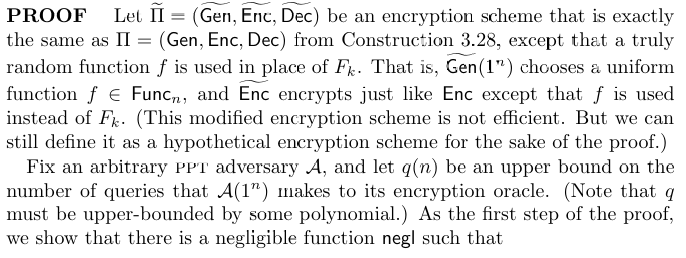
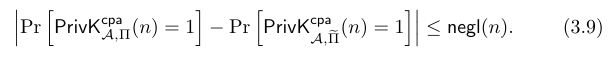

# 3.5.2 CPA-Security from a Pseudorandom Function

## THEOREM 3.29 
If **F** is a pseudorandom function, then Construction 3.28
is a CPA-secure, fixed-length private-key encryption scheme for messages of
length **n**.

## PROOF: 

