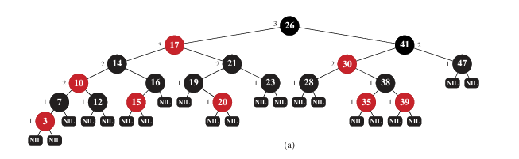
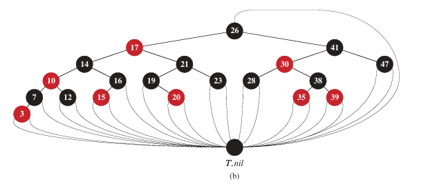
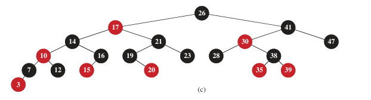

## 13.1 Properties of Red-Black Trees

A Red-Black Tree is a self-balancing Binary Search Tree (BST) with a simple but powerful addition: each node has an **extra bit for color**, which can be either **RED** or **BLACK**.

The colors are not the goal; they are a **tool**. The specific color of any single node isn't what's important. What matters is that by following a set of five rules regarding these colors, the tree can guarantee efficient performance. You can recolor nodes in different ways—the tree itself chooses a valid coloring during balancing operations. The core principle is:

> **Colors are like paint on a fence—you can repaint it, as long as the fence remains structurally sound.**

The five rules that create this "sound structure" are:

1.  **Every node is either red or black.**
2.  **The root is always black.**
3.  **All leaves (NIL) are black.**
4.  **If a node is red, then both its children must be black.** (No two red nodes in a row).
5.  **For every node, all simple paths from it to descendant leaves contain the same number of black nodes.** (Equal "Black Height").

---

### 1. Basic Node Structure

Each node in a Red-Black Tree contains the following attributes to maintain its structure and color:

```
+-------------------+
|      Node         |
|  +-------------+  |
|  |    color    |  |  // RED or BLACK
|  |     key     |  |  // The data value
|  | left | right|  |  // Pointers to children
|  |    p        |  |  // Pointer to parent
|  +-------------+  |
+-------------------+
    /        \
   /          \
LEFT         RIGHT
CHILD        CHILD
```

---

### 2. Visualizing the Five Properties

Let's examine a valid Red-Black Tree to see these rules in action. NIL leaves are shown as black squares (■).

```
        11(B)
        /    \
       /      \
     2(R)      14(B)
    /   \       /   \
  1(B)  7(B)   ■    15(R)
 /  \   /  \        /   \
■    ■ 5(R) ■      ■     ■
        / \
       ■   ■
```

**Now, let's verify all five properties against this diagram:**

*   **✅ Property 1: Every node is either red or black.**
    *   Visually represented by `(B)` for Black and `(R)` for Red.

*   **✅ Property 2: The root is black.**
    *   The root node `11` is black.

*   **✅ Property 3: Every leaf (NIL) is black.**
    *   All `NIL` pointers are represented as black squares (■).

*   **✅ Property 4: Red nodes have black children.**
    *   Let's check the red nodes:
        *   Node `2(R)`: Its children are `1(B)` and `7(B)`.
        *   Node `5(R)`: Its children are both `NIL` (black).
        *   Node `15(R)`: Its children are both `NIL` (black).

*   **✅ Property 5: All paths from a node to descendant leaves contain the same number of black nodes.**
    *   **From the root (11):**
        *   Path 11(B) → 2(R) → 1(B) → NIL: **2 Black Nodes** (11, 1)
        *   Path 11(B) → 2(R) → 7(B) → 5(R) → NIL: **2 Black Nodes** (11, 7)
        *   Path 11(B) → 14(B) → NIL: **2 Black Nodes** (11, 14)
        *   Path 11(B) → 14(B) → 15(R) → NIL: **2 Black Nodes** (11, 14)
    *   All paths have the same black height.



---

### 3. How This Ensures Balance

Property 5 is the key to guaranteeing balance. It ensures that no path from the root to a leaf is more than **twice as long** as any other.

*   The **shortest possible path** is mostly black (e.g., 11(B) → 14(B) → NIL).
*   The **longest possible path** alternates red and black (e.g., 11(B) → 2(R) → 7(B) → 5(R) → NIL).

Because of Property 4 (no two reds in a row), you cannot add more red nodes to a path without also adding black nodes. This constraint keeps the longest path within twice the length of the shortest.

**Result:** The tree's height is always **O(log n)**, which ensures that search, insertion, and deletion operations are efficient.

### Summary of Constraints

| Property | Description                    | Visual Guarantee                                                            |
| :------- | :----------------------------- | :-------------------------------------------------------------------------- |
| **1**    | Node color is Red or Black.    | `(R)` or `(B)` on every node.                                               |
| **2**    | The root is Black.             | The top node is `(B)`.                                                      |
| **3**    | All leaves (NIL) are Black.    | All `NIL` pointers are black (■).                                           |
| **4**    | Red nodes have Black children. | No two `(R)` nodes are directly connected vertically.                       |
| **5**    | Equal black count to leaves.   | For any node, counting `(B)` nodes down to any `NIL` gives the same number. |

---

### The Sentinel (`T.nil`): A Technical Convenience

**The Problem:** In code, handling regular nodes that have `parent`, `left`, and `right` pointers differently from NIL leaves (which have none) complicates the algorithms.

**The Solution:** Use a single, shared **sentinel node**, called `T.nil`, to represent all NILs.

**Before:**
```
    26
    / \
  17  41
 / \  / \
NIL NIL NIL NIL  // Each NIL is separate, with no parent.
```

**After:**
```
       26
      /  \
    17    41
   / \    / \
  ▼   ▼  ▼   ▼  // All pointers to NIL now point to the single T.nil object.
      \
       T.nil (BLACK)
```



**`T.nil` is a "universal soldier":**
*   Its color is always **BLACK** (satisfying Property 3).
*   It has all the same attributes as a normal node (like `parent`), simplifying code logic.
*   It saves memory (one object instead of many NILs).

---

### Understanding Black-Height

**Definition:** The **black-height** of a node `x` is the number of **black nodes** on any simple path from `x` down to a leaf (NIL), **not including** `x` itself.

**Example:**
```
    26(B)  // Not counted!
    /    \
  17(R)   41(B)  // Count black nodes from here down.
```

From node 26 to any leaf:
*   Path 26 → 17(R) → 14(B) → NIL: **1 Black Node** (14)
*   Path 26 → 41(B) → 30(R) → NIL: **1 Black Node** (41)

**The Key Insight:** Because of Property 5, this black-height is **identical** for all paths from a given node, which is what guarantees the tree remains balanced.



---

### Conclusion

1.  **Colors are a Tool:** The specific coloring is a means to an end (balance), not the end itself.
2.  **The Sentinel (`T.nil`)** is a technical trick to simplify the code.
3.  **Black-Height** is the core metric that, when kept consistent across all paths, ensures the tree's height is logarithmic.

---
---
---

## 📌 Lemma 13.1 Statement

> A red-black tree with `n` internal nodes has height at most `2 lg(n + 1)`.

In mathematical terms, if we let `h` be the height of the tree:
$$ h \leq 2 \log_2(n + 1) $$
This guarantees the tree remains approximately balanced, as its height grows only logarithmically with the number of nodes. 
> Just the boundaries

---

## 🧠 Part 1: The Core Claim & Induction Setup

The proof strategy is to first prove a stronger claim about the structure of the tree.

**Claim:** The subtree rooted at any node `x` contains at least `2^{bh(x)} - 1` (**This is the MINIMUM number of nodes in a subtree rooted in x**) internal nodes.

Where `bh(x)` is the **black-height** of node `x`—the number of black nodes on any path from `x` to a leaf (not including `x` itself).

> In simple terms: "If you have a lot of black nodes on the paths, then there should be a lot of common nodes" 

### **THE TREE IN FIGURE 13.1:**
```text
        26(B) bh=2
        /         \
      17(R)       41(B) bh=1
     /    \       /    \
   14(B)  21(B)  30(R)  47(R)
   bh=1   bh=1   bh=1   bh=1
  /  \    /  \   /  \   /  \
 ■    ■  ■    ■ ■    ■ ■    ■
bh=0     bh=0    bh=0   bh=0
```

### Proof by Induction on the Height of `x`

#### **Base Case: Height of `x` is 0**
If the height of `x` is 0, then `x` must be a leaf (`T.nil`).
*   The black-height of a leaf (`T.nil`) is 0: `bh(x) = 0`.
*   The number of internal nodes in a subtree rooted at a leaf is 0.

Let's check the claim:
$$ 2^{bh(x)} - 1 = 2^0 - 1 = 1 - 1 = 0 $$
The claim holds, as `0 >= 0`.

#### **Inductive Step: Height of `x` is > 0**
We assume the claim is true for all nodes with a height less than `x`'s height.

Node `x` is an internal node with a positive height, so it has two children. Each child can be an internal node or `T.nil`.

**Crucial Observation:** The black-height of a child depends on its color relative to `x`.
*   If a child is **BLACK**, its black-height is `bh(x) - 1`.
    *   Why? The path goes through this black child, which *is* counted in its own black-height, so we have `bh(x) - 1` remaining black nodes to reach the original count.
*   If a child is **RED**, its black-height is `bh(x)`.
    *   Why? The path goes through this red child, which is *not* counted in its own black-height, so we still need all `bh(x)` black nodes.

Since the height of each child is less than the height of `x`, we can apply the **inductive hypothesis** to them.

*   **Minimum nodes in left child's subtree:** `2^{bh(child_{left})} - 1`
*   **Minimum nodes in right child's subtree:** `2^{bh(child_{right})} - 1`

A child's black-height is *at least* `bh(x) - 1` (this is the worst case for our count, which happens if the child is black). Therefore, each child's subtree has at least:
$$ 2^{bh(x) - 1} - 1 \text{ internal nodes} $$

Now, the total number of internal nodes in the subtree rooted at `x` is:
\[ \text{(Nodes in left subtree)} + \text{(Nodes in right subtree)} + \text{(Node x itself)} \]
\[ \geq \left[2^{bh(x)-1} - 1\right] + \left[2^{bh(x)-1} - 1\right] + 1 \]
\[ = 2 \cdot \left(2^{bh(x)-1} - 1\right) + 1 \]
\[ = 2^{bh(x)} - 2 + 1 \]
\[ = 2^{bh(x)} - 1 \]

This completes the inductive step and proves the core claim. ✅

---

## 🔗 Part 2: Connecting to the Tree Height

Now we link this structural claim to the overall height `h` of the tree.

Let `h` be the height of the entire red-black tree.

From **Property 4** (a red node must have black children), we know that on any path from the root to a leaf, **at least half** of the nodes (excluding the root itself) must be black.

Let `bh(root)` be the black-height of the root.
*   The longest path from the root to a leaf has length `h`.
*   At least half of these `h` nodes (not counting the root) are black.
*   Therefore, the number of black nodes on this path, which is `bh(root)`, must be at least `h/2`:

$$ bh(root) \geq \lceil h/2 \rceil $$
For simplicity in the proof, we use:
$$ bh(root) \geq h/2 $$

Now, we apply our previously proven claim to the **root** of the entire tree. The whole tree has `n` internal nodes and is rooted at the root, so:
$$ n \geq 2^{bh(root)} - 1 $$
Substituting `bh(root) >= h/2`:
$$ n \geq 2^{h/2} - 1 $$

---

## 📐 Part 3: The Final Algebraic Manipulation

We now solve for `h` in terms of `n`.

Start with:
$$ n \geq 2^{h/2} - 1 $$

Add 1 to both sides:
$$ n + 1 \geq 2^{h/2} $$

Take the logarithm base-2 of both sides:
$$ \log_2(n + 1) \geq \log_2(2^{h/2}) $$
$$ \log_2(n + 1) \geq h/2 $$

Multiply both sides by 2 to solve for `h`:
$$ 2 \log_2(n + 1) \geq h $$

Or, equivalently:
$$ h \leq 2 \log_2(n + 1) $$

**This is exactly what we set out to prove.** 🎉

---

## 💡 Implications of the Lemma

As stated in the text, this lemma is fundamental. Since the height `h` of a red-black tree is `O(log n)`, all basic dynamic-set operations that run in time proportional to the height in a BST now run in `O(log n)` time on a red-black tree.

*   `SEARCH`, `MINIMUM`, `MAXIMUM`, `SUCCESSOR`, `PREDECESSOR` are all `O(log n)`.

The text also makes a critical point: while the standard BST `INSERT` and `DELETE` run in `O(log n)` time *given* a red-black tree, they do not maintain the red-black properties. The remainder of the chapter details how to modify these operations to preserve the properties while still achieving `O(log n)` time complexity.