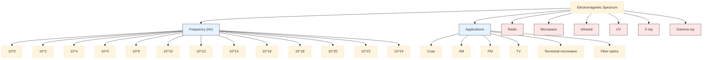

# Classes of Links

```mermaid
%%{init: {'theme': 'base', 'themeVariables': { 'clusterBkg': '#f0f0f0'}}}%%
graph TD
    A["Electromagnetic Spectrum"] --> B["Frequency (Hz)"]
    A --> C["Applications"]
    
    B --> B1["10^0"]
    B --> B2["10^2"]
    B --> B3["10^4"]
    B --> B4["10^6"]
    B --> B5["10^8"]
    B --> B6["10^10"]
    B --> B7["10^12"]
    B --> B8["10^14"]
    B --> B9["10^16"]
    B --> B10["10^18"]
    B --> B11["10^20"]
    B --> B12["10^22"]
    B --> B13["10^24"]
    
    A --> D["Radio"]
    A --> E["Microwave"]
    A --> F["Infrared"]
    A --> G["UV"]
    A --> H["X-ray"]
    A --> I["Gamma ray"]
    
    C --> C1["Coax"]
    C --> C2["AM"]
    C --> C3["FM"]
    C --> C4["TV"]
    C --> C5["Terrestrial microwave"]
    C --> C6["Fiber optics"]
    
    %% Styling
    style B fill:#e6f3ff,stroke:#333
    style C fill:#e6f3ff,stroke:#333
    style D fill:#ffe6e6,stroke:#333
    style E fill:#ffe6e6,stroke:#333
    style F fill:#ffe6e6,stroke:#333
    style G fill:#ffe6e6,stroke:#333
    style H fill:#ffe6e6,stroke:#333
    style I fill:#ffe6e6,stroke:#333
```