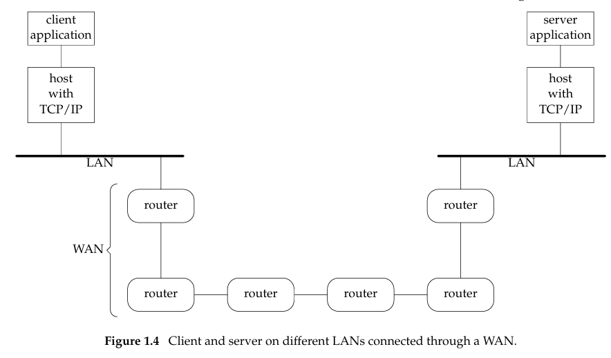
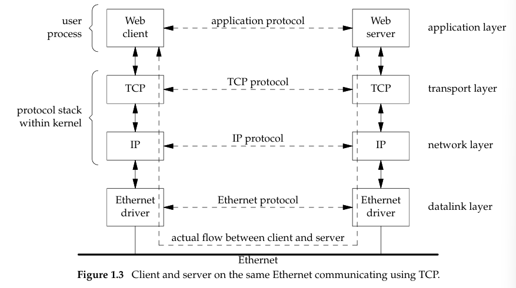

# **Core Concepts in Network Programming**
#### **1. Client-Server Model**
- **Client**: Initiates requests (e.g., web browser).  
- **Server**: Waits for requests, responds (e.g., web server).  
- **Simplifies protocols** by enforcing a clear request-response flow.  
- **Asynchronous callbacks** are rare but needed for real-time apps (e.g., chat servers).  

#### **2. Handling Multiple Clients**
- Servers must manage **concurrent connections** (Figure 1.2).  
- Techniques:  
  - **Multiprocessing** (e.g., `fork()`).  
  - **Multithreading**.  
  - **I/O Multiplexing** (`select`, `poll`, `epoll`).  
  - **Asynchronous I/O** (e.g., `libuv`).  

#### **3. Protocol Stack (TCP/IP)**
- **Layered communication** (Figure 1.3):  
  ```plaintext
  Application Layer (HTTP, FTP)  
  └── Transport Layer (TCP/UDP)  
      └── Network Layer (IPv4/IPv6)  
          └── Link Layer (Ethernet/Wi-Fi)  
  ```
- **Data Flow**:  
  - Client/Server → TCP/IP → Kernel → Network → Reverse on the other end.  
  


#### **4. IPv4 vs. IPv6**
- **IPv4**: 32-bit addresses (e.g., `192.168.1.1`).  
- **IPv6**: 128-bit addresses (e.g., `2001:0db8:85a3::8a2e:0370:7334`).  
- **Key Differences**: Larger address space, built-in security (IPsec), simplified headers.  


---

### **Practical Implementation**
#### **1. Simple TCP Client (IPv4)**
```c
#include <stdio.h>
#include <sys/socket.h>
#include <arpa/inet.h>

int main() {
    int sock = socket(AF_INET, SOCK_STREAM, 0);
    struct sockaddr_in server_addr = {
        .sin_family = AF_INET,
        .sin_port = htons(8080),
        .sin_addr.s_addr = inet_addr("192.168.1.2")
    };

    connect(sock, (struct sockaddr*)&server_addr, sizeof(server_addr));
    send(sock, "Hello", 5, 0);
    close(sock);
    return 0;
}
```

#### **2. Protocol-Independent Code**
- Use `getaddrinfo()` to handle **both IPv4 and IPv6**:  
  ```c
  struct addrinfo hints = { .ai_family = AF_UNSPEC, .ai_socktype = SOCK_STREAM };
  getaddrinfo("example.com", "http", &hints, &res);
  ```

#### **3. Error Handling**
- **Wrapper functions** for syscalls (simplifies code):  
  ```c
  void Connect(int sock, const struct sockaddr *addr, socklen_t len) {
      if (connect(sock, addr, len) < 0) {
          perror("connect"); 
          exit(1);
      }
  }
  ```

---

### **Key Takeaways**
1. **Design First**: Decide client/server roles and protocol rules upfront.  
2. **Concurrency is Critical**: Servers need strategies to handle multiple clients.  
3. **Leverage the Stack**: Understand how TCP/IP layers interact (Figure 1.3).  
4. **Embrace POSIX**: Write portable code using standardized APIs.  

For deeper dives:  
- **Books**: *UNIX Network Programming* (Stevens), *Beej’s Guide*.  
- **Tools**: Wireshark (packet analysis), `strace` (syscall debugging).  