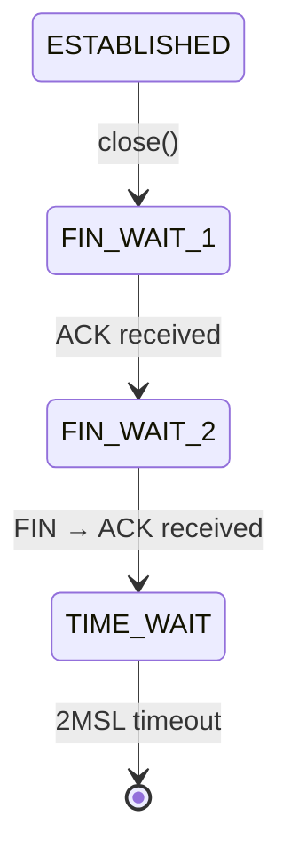

# 🌟 **TIME_WAIT status in TCP: Why is it needed and why is it important?** 🌟  

The **`TIME_WAIT`** state is one of the most mysterious in TCP, but critically important for reliability. Let's figure it out!  

---

## 🔥 **What is TIME_WAIT?**  
When one side (usually **the client**) performs an **active closure** (`close()`), TCP enters the **`TIME_WAIT`** state and **holds `2MSL`** (where **MSL = Maximum Segment Lifetime**).  

📌 **MSL** is the maximum packet lifetime on the network (usually **30 sec–2 min**).  
📌 **2MSL** = **1-4 minutes** (on Linux, usually **60 seconds**).  

---

## ❓ **Why do I need TIME_WAIT?**  

### 1️⃣ **Guarantees reliable connection termination**  
- If the last **ACK** is lost, the server will resend **FIN**.  
- The client in **`TIME_WAIT'** will be able to resend **ACK** and avoid a "hanging" connection.  

### 2️⃣ **Protects against "zombie packages"** 🧟  
- **Old duplicate packets** may get stuck on the network (due to routing, loops, etc.).
- **`TIME_WAIT`** ensures that all such packets **disappear** before the port can be used again.  

> **Example:**  
> Let's say the connection `A:1500 → B:21` is closed.  
> If you immediately reuse the same ports, **old packets** can get into the new connection and break everything!  

---

## ⚠️ **Problems with TIME_WAIT**  
### **Is the server in TIME_WAIT?** This is usually **normal** (unless he is the initiator of the closure).  
### **Is the client in TIME_WAIT?** May end up with **ports** (if there are many connections).  

**Solution:**  
```c
int yes = 1;
setsockopt(sock, SOL_SOCKET, SO_REUSEADDR, &yes, sizeof(yes)); // Port reuse
```

---

## 📊 **TCP Status diagram (active closure)**  


---

## 💡 **Exceptions (Berkeley TCP)**  
Some systems (such as Linux) **allow a new connection** from `TIME_WAIT` if:
✅ **SYN number > last number of the previous connection**.  
📌 Is used in `rsh' (but not always safely, see RFC 1185).  

---

## 🚀 **Conclusion**  
* **`TIME_WAIT' = 2MSL** (usually **1-4 minutes**).  
, **Is needed for:**
- Reliable termination (if **ACK is lost**).  
   - Protection against **old packages**.  
⚠️ **Problems:** May interfere with frequent reconnections (treated by `SO_REUSEADDR').  

Do you want to take a deeper look at **Linux kernel settings** for `TIME_WAIT'? Write! 😎