## 📋 Header Overview

```c
#pragma once
#ifndef SNMP_H
#define SNMP_H

#ifdef __cplusplus
extern "C"
{
#endif
```

**Purpose:** Standard C header guards to prevent multiple inclusions and ensure C++ compatibility.

**This approach is widely considered a best practice.**

The combination of `#pragma once` and the classic `#ifndef` provides a balanced approach to protect against multiple inclusion of header files, though the actual benefits may vary depending on the specific use case.

### Why this approach is commonly recommended:

1. **`#pragma once` - Potential speed and convenience**
    * **May be faster in some scenarios**: On projects with complex include hierarchies, some compilers can optimize file processing using filesystem metadata.
    * **Convenience factor**: Avoids the need to maintain unique macro names across the codebase.
    * **Reduced naming conflicts**: Eliminates potential macro name collisions between different headers.

2. **`#ifndef` / `#define` - Portability and reliability**
    * **Wide portability**: The `#ifndef` directive is a C/C++ language standard that should work on any compliant compiler.
    * **Fallback protection**: Provides a reliable alternative when `#pragma once` support is limited or encounters unusual filesystem situations.

### Performance Observations from Testing:

Our limited testing showed mixed results that may not be representative of all scenarios:

- **Small to medium files**: Performance differences were generally minor (0.01-0.05s)
- **Larger inclusion scenarios**: Some tests showed `#pragma once` with modest improvements
- **Combined approach**: Performance was comparable to either method alone in most cases

**Note**: The actual performance impact likely depends on many factors including compiler implementation, filesystem characteristics, project structure, and build environment. The benefits may be more significant in very large projects with complex include graphs.

### Practical Considerations:

* **Modern compiler behavior**: Most contemporary compilers (GCC, Clang, MSVC) recognize `#pragma once` while maintaining `#ifndef` compatibility
* **Compiler variations**: Some compilers may optimize the combined approach differently than others
* **Edge case handling**: The dual approach may provide additional safety in unusual environments like network filesystems or with symbolic links

### Conservative Recommendation:

This combined approach represents a reasonable compromise that prioritizes compatibility while potentially offering performance benefits in some situations. For maximum portability across diverse build environments, the additional `#ifndef` guard provides insurance against `#pragma once` limitations in edge cases.

The minimal overhead of including both directives appears to be acceptable for most practical purposes, though individual projects should consider their specific requirements and target environments.

# Implementation Details & Testing - https://github.com/dima853/self_university/tree/main/network/c/compatibility/ifndef_pragmaonce

---

## 🌐 Network Constants

```c
1) #define SNMP_PORT 161      /* standard UDP port for SNMP agents \
                            * to receive requests messages */
2) #define SNMP_TRAP_PORT 162 /* standard UDP port for SNMP      \
                            * managers to receive notificaion \
                            * (trap and inform) messages */
```

**Purpose:** Standard IANA-assigned ports for SNMP operations.

| Port    | Direction       | Purpose                    |
| ------- | --------------- | -------------------------- |
| **161** | Manager → Agent | GET/SET requests to agents |
| **162** | Agent → Manager | Traps/Informs to managers  |


## ✅ **OFFICIALLY CONFIRMED BY IANA:**

**Service Name: [snmp (Port 161)](https://www.iana.org/assignments/service-names-port-numbers/service-names-port-numbers.xhtml?search=161)**
```
Port Number: 161
Transport Protocol: tcp, udp  
Description: SNMP
```

**Service Name: [snmptrap (Port 162)](https://www.iana.org/assignments/service-names-port-numbers/service-names-port-numbers.xhtml?search=162)** 
```
Port Number: 162
Transport Protocol: tcp, udp
Description: SNMPTRAP
Assignee: Marshall Rose
```

---

```c
1) #define SNMP_MAX_LEN 1500    /* typical maximum message size */
2) #define SNMP_MIN_MAX_LEN 484 /* minimum maximum message size */
3) #define SNMP_MAX_PACKET_LEN (0x7fffffff)
```

## 1) 📄 From RFC 894 (IP over Ethernet):

**Page 1:**
> "The maximum length of an IP datagram sent over an Ethernet is 1500 octets."

**This corresponds to:** `#define SNMP_MAX_LEN 1500`


## 2) 📄 From RFC 3416 (SNMP Protocol Operations):

**Section 4.2:**
> "The maximum size of an SNMP message is limited to the minimum of: (a) 484 octets (b) the maximum message size that the destination can accept"

**This corresponds to:** `#define SNMP_MIN_MAX_LEN 484`
## 3) 📄 From RFC 3416 (SNMP Protocol Operations):

**Page 9, section 4.1:**
> "A compliant implementation must support as many variable bindings in a PDU or BulkPDU as fit into the overall maximum message size limit of the SNMP engine, but no more than 2147483647 variable bindings."

**This corresponds to:** `#define SNMP_MAX_PACKET_LEN (0x7fffffff)` = 2,147,483,647

**Purpose:** Message size limits for memory allocation and buffer management.

---

## 🔄 SNMP Version

```c
#define SNMP_VERSION_3 3
```

**Purpose:** This header focuses on **SNMPv3** (the modern, secure version).

---

## 📨 PDU Types - SNMP Protocol Data Units

### Core Operations (RFC 3416)
```c
#define SNMP_MSG_GET (ASN_CONTEXT | ASN_CONSTRUCTOR | 0x0)      /* a0=160 */
#define SNMP_MSG_GETNEXT (ASN_CONTEXT | ASN_CONSTRUCTOR | 0x1)  /* a1=161 */
#define SNMP_MSG_RESPONSE (ASN_CONTEXT | ASN_CONSTRUCTOR | 0x2) /* a2=162 */
#ifndef NETSNMP_NO_WRITE_SUPPORT
#define SNMP_MSG_SET (ASN_CONTEXT | ASN_CONSTRUCTOR | 0x3) /* a3=163 */
#endif
```

**ASN.1 Encoding Explanation:**
- `ASN_CONTEXT`: Context-specific tag
- `ASN_CONSTRUCTOR`: Constructed type (contains other elements)
- `0x0-0x3`: PDU type identifier

| PDU Type     | Value | Purpose                            |
| ------------ | ----- | ---------------------------------- |
| **GET**      | 160   | Retrieve specific variable values  |
| **GETNEXT**  | 161   | Retrieve next variable in sequence |
| **RESPONSE** | 162   | Response to any request            |
| **SET**      | 163   | Modify variable values             |

### Advanced Operations (SNMPv2c/v3)
```c
#define SNMP_MSG_GETBULK (ASN_CONTEXT | ASN_CONSTRUCTOR | 0x5) /* a5=165 */
#define SNMP_MSG_INFORM (ASN_CONTEXT | ASN_CONSTRUCTOR | 0x6)  /* a6=166 */
#define SNMP_MSG_TRAP2 (ASN_CONTEXT | ASN_CONSTRUCTOR | 0x7)   /* a7=167 */
#define SNMP_MSG_REPORT (ASN_CONTEXT | ASN_CONSTRUCTOR | 0x8) /* a8=168 */
```

| PDU Type    | Value | Purpose                         |
| ----------- | ----- | ------------------------------- |
| **GETBULK** | 165   | Efficient bulk data retrieval   |
| **INFORM**  | 166   | Acknowledged notification       |
| **TRAPv2**  | 167   | Unacknowledged notification     |
| **REPORT**  | 168   | Error reporting between engines |

---

## ⚙️ Internal Processing States

These are **NOT** network protocol values - they're internal state machine states for SET operation processing:

```c
#define SNMP_MSG_INTERNAL_SET_BEGIN -1
#define SNMP_MSG_INTERNAL_SET_RESERVE1 0
#define SNMP_MSG_INTERNAL_SET_RESERVE2 1
#define SNMP_MSG_INTERNAL_SET_ACTION 2
#define SNMP_MSG_INTERNAL_SET_COMMIT 3
#define SNMP_MSG_INTERNAL_SET_FREE 4
#define SNMP_MSG_INTERNAL_SET_UNDO 5
```

**SET Operation State Flow:**
```
RESERVE1 → RESERVE2 → ACTION → COMMIT → FREE
                    ↘ UNDO (if error)
```

**Advanced Internal States:**
```c
#define SNMP_MSG_INTERNAL_CHECK_VALUE 17
#define SNMP_MSG_INTERNAL_ROW_CREATE 18
#define SNMP_MSG_INTERNAL_UNDO_SETUP 19
// ... etc
```

**Purpose:** These implement the **transaction-like behavior** for SNMP SET operations, allowing rollback on failure.

---

## ✅ Confirmed Class Macro

```c
#define SNMP_CMD_CONFIRMED(c) (c == SNMP_MSG_INFORM || c == SNMP_MSG_GETBULK || \
                               c == SNMP_MSG_GETNEXT || c == SNMP_MSG_GET ||    \
                               c == SNMP_MSG_SET)
```

**Purpose:** Identifies PDUs that **require a response** from the receiver.

| Confirmed             | Unconfirmed            |
| --------------------- | ---------------------- |
| GET, GETNEXT, GETBULK | TRAP                   |
| SET, INFORM           | RESPONSE               |
| (Expect response)     | (No response expected) |

---

## ❌ Exception Values (SNMPv2/v3)

```c
#define SNMP_NOSUCHOBJECT (ASN_CONTEXT | ASN_PRIMITIVE | 0x0)   /* 80=128 */
#define SNMP_NOSUCHINSTANCE (ASN_CONTEXT | ASN_PRIMITIVE | 0x1) /* 81=129 */
#define SNMP_ENDOFMIBVIEW (ASN_CONTEXT | ASN_PRIMITIVE | 0x2)   /* 82=130 */
```

**Purpose:** Special return values for variable binding exceptions.

| Exception          | Meaning                          |
| ------------------ | -------------------------------- |
| **noSuchObject**   | Requested object doesn't exist   |
| **noSuchInstance** | Requested instance doesn't exist |
| **endOfMibView**   | No more variables in MIB tree    |

---

## 🚨 Error Status Codes

### Basic Errors (SNMPv1)
```c
#define SNMP_ERR_NOERROR (0)
#define SNMP_ERR_TOOBIG (1)
#define SNMP_ERR_NOSUCHNAME (2)
#define SNMP_ERR_BADVALUE (3)
#define SNMP_ERR_READONLY (4)
#define SNMP_ERR_GENERR (5)
```

### Extended Errors (SNMPv2/v3)
```c
#define SNMP_ERR_NOACCESS (6)
#define SNMP_ERR_WRONGTYPE (7)
#define SNMP_ERR_WRONGLENGTH (8)
#define SNMP_ERR_WRONGENCODING (9)
// ... up to SNMP_ERR_INCONSISTENTNAME (18)
```

**Key Error Explanations:**
- `noAccess`: Authentication/authorization failure
- `authorizationError`: VACM access control denial  
- `inconsistentName`: Row creation semantic error

```c
#define SNMP_VALIDATE_ERR(x) ((x > MAX_SNMP_ERR) ? SNMP_ERR_GENERR : (x < SNMP_ERR_NOERROR) ? SNMP_ERR_GENERR : x)
```

**Purpose:** Sanitizes error codes to prevent invalid values.

---

## 🗃️ Row Status Values (For Table Operations)

```c
#define SNMP_ROW_NONEXISTENT 0
#define SNMP_ROW_ACTIVE 1
#define SNMP_ROW_NOTINSERVICE 2
#define SNMP_ROW_NOTREADY 3
#define SNMP_ROW_CREATEANDGO 4
#define SNMP_ROW_CREATEANDWAIT 5
#define SNMP_ROW_DESTROY 6
```

**Purpose:** Implements **dynamic row creation/deletion** in SNMP tables.

**Usage Flow:**


---

## 💾 Storage Types

```c
#define SNMP_STORAGE_NONE 0
#define SNMP_STORAGE_OTHER 1
#define SNMP_STORAGE_VOLATILE 2
#define SNMP_STORAGE_NONVOLATILE 3
#define SNMP_STORAGE_PERMANENT 4
#define SNMP_STORAGE_READONLY 5
```

**Purpose:** Defines data persistence characteristics for MIB objects.

---

## 🛡️ Security Definitions (SNMPv3)

### Message Processing Models
```c
#define SNMP_MP_MODEL_SNMPv3 3
```

### Security Models
```c
#define SNMP_SEC_MODEL_ANY 0
#define SNMP_SEC_MODEL_USM 3  /* User-based Security Model */
#define SNMP_SEC_MODEL_TSM 4  /* Transport Security Model */
```

### Security Levels
```c
#define SNMP_SEC_LEVEL_NOAUTH 1        /* noAuthNoPriv */
#define SNMP_SEC_LEVEL_AUTHNOPRIV 2    /* authNoPriv */
#define SNMP_SEC_LEVEL_AUTHPRIV 3      /* authPriv */
```

### Message Flags
```c
#define SNMP_MSG_FLAG_AUTH_BIT 0x01    /* Message is authenticated */
#define SNMP_MSG_FLAG_PRIV_BIT 0x02    /* Message is encrypted */
#define SNMP_MSG_FLAG_RPRT_BIT 0x04    /* Message is reportable */
```

**Security Combinations:**
```c
// No security
flags = 0

// Authentication only  
flags = SNMP_MSG_FLAG_AUTH_BIT

// Authentication + Encryption
flags = SNMP_MSG_FLAG_AUTH_BIT | SNMP_MSG_FLAG_PRIV_BIT

// Reportable message
flags = SNMP_MSG_FLAG_RPRT_BIT
```

---

## 🎛️ Control Flags (Implementation-Specific)

```c
#define UCD_MSG_FLAG_RESPONSE_PDU 0x100
#define UCD_MSG_FLAG_EXPECT_RESPONSE 0x200
#define UCD_MSG_FLAG_FORCE_PDU_COPY 0x400
#define UCD_MSG_FLAG_ALWAYS_IN_VIEW 0x800
```

**Purpose:** Internal implementation controls for message processing.

---

## 🌳 OID Base Definitions

```c
#define SNMP_OID_INTERNET 1, 3, 6, 1
#define SNMP_OID_ENTERPRISES SNMP_OID_INTERNET, 4, 1
#define SNMP_OID_MIB2 SNMP_OID_INTERNET, 2, 1
#define SNMP_OID_SNMPV2 SNMP_OID_INTERNET, 6
```

**OID Tree Structure:**
```
1.3.6.1 (internet)
├── 2.1 (mib-2)
├── 4.1 (enterprises) 
└── 6 (snmpV2)
```

---

## 🔧 Function Prototypes

### Utility Functions
```c
char *uptime_string(u_long, char *);           // Convert uptime to string
void xdump(const void *, size_t, const char *); // Hex dump utility
```

### ASN.1 Parsing/Building (Core Protocol Engine)
```c
u_char *snmp_parse_var_op(u_char *, oid *, size_t *, u_char *,
                          size_t *, u_char **, size_t *);
u_char *snmp_build_var_op(u_char *, const oid *, size_t *, u_char,
                          size_t, const void *, size_t *);
```

**Purpose:** These functions implement the **ASN.1 BER encoding/decoding** for SNMP protocol data units.

---

## 🏁 Footer
```c
#ifdef __cplusplus
}
#endif
#endif /* SNMP_H */
```

**Purpose:** Close the C++ extern "C" block and header guard.

## 📊 Summary

This header provides:

1. **Protocol Constants** - PDU types, error codes, ports
2. **SNMPv3 Security** - Security models, levels, flags  
3. **Internal Processing** - State machines for SET operations
4. **ASN.1 Utilities** - Encoding/decoding functions
5. **MIB Management** - Row status, storage types, OID bases

# How It Works? (Super Briefly)

```mermaid
flowchart TD
    %% Header Protection
    A[SNMP Header Structure] --> B[Header Guards]
    B --> B1["#pragma once"]
    B --> B2["#ifndef SNMP_H"]
    B --> B3["C++ extern C"]
    
    %% Network Layer
    A --> C[🌐 Network Constants]
    C --> C1[SNMP_PORT: 161]
    C --> C2[SNMP_TRAP_PORT: 162]
    C --> C3[SNMP_MAX_LEN: 1500]
    C --> C4[SNMP_MIN_MAX_LEN: 484]
    
    %% Protocol Version
    A --> D[🔄 SNMP Version]
    D --> D1[SNMP_VERSION_3: 3]
    
    %% PDU Types
    A --> E[📨 PDU Types]
    E --> E1[Core Operations]
    E1 --> E11[GET: 160]
    E1 --> E12[GETNEXT: 161]
    E1 --> E13[RESPONSE: 162]
    E1 --> E14[SET: 163]
    
    E --> E2[Advanced Operations]
    E2 --> E21[GETBULK: 165]
    E2 --> E22[INFORM: 166]
    E2 --> E23[TRAPv2: 167]
    E2 --> E24[REPORT: 168]
    
    %% Internal Processing
    A --> F[⚙️ Internal Processing]
    F --> F1[SET State Machine]
    F1 --> F11["BEGIN (-1)"]
    F1 --> F12["RESERVE1 (0)"]
    F1 --> F13["RESERVE2 (1)"]
    F1 --> F14["ACTION (2)"]
    F1 --> F15["COMMIT (3)"]
    F1 --> F16["FREE (4)"]
    F1 --> F17["UNDO (5)"]
    
    %% Confirmed Operations
    A --> G[✅ Confirmed PDUs]
    G --> G1[GET]
    G --> G2[GETNEXT]
    G --> G3[GETBULK]
    G --> G4[SET]
    G --> G5[INFORM]
    
    %% Exception Handling
    A --> H[❌ Exception Values]
    H --> H1[noSuchObject: 128]
    H --> H2[noSuchInstance: 129]
    H --> H3[endOfMibView: 130]
    
    %% Error System
    A --> I[🚨 Error Status Codes]
    I --> I1[Basic Errors v1]
    I1 --> I11[noError: 0]
    I1 --> I12[tooBig: 1]
    I1 --> I13[noSuchName: 2]
    I1 --> I14[badValue: 3]
    I1 --> I15[readOnly: 4]
    I1 --> I16[genErr: 5]
    
    I --> I2[Extended Errors v2/v3]
    I2 --> I21[noAccess: 6]
    I2 --> I22[wrongType: 7]
    I2 --> I23[wrongLength: 8]
    I2 --> I24[...up to 18]
    
    %% Table Management
    A --> J[🗃️ Row Status Values]
    J --> J1[nonExistent: 0]
    J --> J2[active: 1]
    J --> J3[notInService: 2]
    J --> J4[notReady: 3]
    J --> J5[createAndGo: 4]
    J --> J6[createAndWait: 5]
    J --> J7[destroy: 6]
    
    %% Storage Types
    A --> K[💾 Storage Types]
    K --> K1[none: 0]
    K --> K2[other: 1]
    K --> K3[volatile: 2]
    K --> K4[nonVolatile: 3]
    K --> K5[permanent: 4]
    K --> K6[readOnly: 5]
    
    %% Security Framework
    A --> L[🛡️ SNMPv3 Security]
    L --> L1[Message Processing]
    L1 --> L11[MP_MODEL_SNMPv3: 3]
    
    L --> L2[Security Models]
    L2 --> L21[SEC_MODEL_ANY: 0]
    L2 --> L22[SEC_MODEL_USM: 3]
    L2 --> L23[SEC_MODEL_TSM: 4]
    
    L --> L3[Security Levels]
    L3 --> L31[noAuthNoPriv: 1]
    L3 --> L32[authNoPriv: 2]
    L3 --> L33[authPriv: 3]
    
    L --> L4[Message Flags]
    L4 --> L41[authBit: 0x01]
    L4 --> L42[privBit: 0x02]
    L4 --> L43[reportBit: 0x04]
    
    %% OID Structure
    A --> M[🌳 OID Base Definitions]
    M --> M1["internet: 1.3.6.1"]
    M1 --> M11["mib-2: 1.3.6.1.2.1"]
    M1 --> M12["enterprises: 1.3.6.1.4.1"]
    M1 --> M13["snmpV2: 1.3.6.1.6"]
    
    %% Core Functions
    A --> N[🔧 Function Prototypes]
    N --> N1[Utility Functions]
    N1 --> N11["uptime_string()"]
    N1 --> N12["xdump()"]
    
    N --> N2[ASN.1 Engine]
    N2 --> N21["snmp_parse_var_op()"]
    N2 --> N22["snmp_build_var_op()"]
    
    %% Footer
    A --> O[🏁 Footer]
    O --> O1["C++ extern C end"]
    O --> O2["#endif // SNMP_H"]
    
    %% Relationships
    E14 --> F1[triggers]
    G --> E13[expects response]
    H --> I[error cases]
    J --> F14[used in SET]
    L --> N2[secures encoding]
    
    %% Protocol Flow
    subgraph Protocol Flow
        P1[Manager] -->|GET/SET Port 161| P2[Agent]
        P2 -->|TRAP/INFORM Port 162| P1
        P2 --> P3[PDU Processing]
        P3 --> P4[ASN.1 BER Encoding]
        P4 --> P5[Security Wrapping]
        P5 --> P6[Network Transport]
    end
    
    %% Style Definitions
    classDef header fill:#e1f5fe
    classDef network fill:#f3e5f5
    classDef pdu fill:#e8f5e8
    classDef security fill:#fff3e0
    classDef error fill:#ffebee
    classDef internal fill:#fce4ec
    
    class A,B header
    class C,C1,C2,C3,C4 network
    class E,E1,E2,E11,E12,E13,E14,E21,E22,E23,E24 pdu
    class L,L1,L2,L3,L4,L11,L21,L22,L23,L31,L32,L33,L41,L42,L43 security
    class H,I,I1,I2,I11,I12,I13,I14,I15,I16,I21,I22,I23,I24 error
    class F,F1,F11,F12,F13,F14,F15,F16,F17 internal
```

