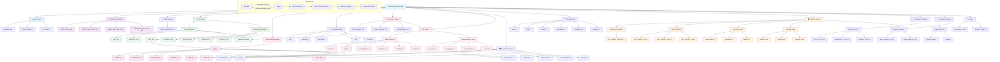

```mermaid
flowchart TD
    %% Header Protection
    A[SNMP Header Structure] --> B[Header Guards]
    B --> B1["#pragma once"]
    B --> B2["#ifndef SNMP_H"]
    B --> B3["C++ extern C"]
    
    %% Network Layer
    A --> C[🌐 Network Constants]
    C --> C1[SNMP_PORT: 161]
    C --> C2[SNMP_TRAP_PORT: 162]
    C --> C3[SNMP_MAX_LEN: 1500]
    C --> C4[SNMP_MIN_MAX_LEN: 484]
    
    %% Protocol Version
    A --> D[🔄 SNMP Version]
    D --> D1[SNMP_VERSION_3: 3]
    
    %% PDU Types
    A --> E[📨 PDU Types]
    E --> E1[Core Operations]
    E1 --> E11[GET: 160]
    E1 --> E12[GETNEXT: 161]
    E1 --> E13[RESPONSE: 162]
    E1 --> E14[SET: 163]
    
    E --> E2[Advanced Operations]
    E2 --> E21[GETBULK: 165]
    E2 --> E22[INFORM: 166]
    E2 --> E23[TRAPv2: 167]
    E2 --> E24[REPORT: 168]
    
    %% Internal Processing
    A --> F[⚙️ Internal Processing]
    F --> F1[SET State Machine]
    F1 --> F11["BEGIN (-1)"]
    F1 --> F12["RESERVE1 (0)"]
    F1 --> F13["RESERVE2 (1)"]
    F1 --> F14["ACTION (2)"]
    F1 --> F15["COMMIT (3)"]
    F1 --> F16["FREE (4)"]
    F1 --> F17["UNDO (5)"]
    
    %% Confirmed Operations
    A --> G[✅ Confirmed PDUs]
    G --> G1[GET]
    G --> G2[GETNEXT]
    G --> G3[GETBULK]
    G --> G4[SET]
    G --> G5[INFORM]
    
    %% Exception Handling
    A --> H[❌ Exception Values]
    H --> H1[noSuchObject: 128]
    H --> H2[noSuchInstance: 129]
    H --> H3[endOfMibView: 130]
    
    %% Error System
    A --> I[🚨 Error Status Codes]
    I --> I1[Basic Errors v1]
    I1 --> I11[noError: 0]
    I1 --> I12[tooBig: 1]
    I1 --> I13[noSuchName: 2]
    I1 --> I14[badValue: 3]
    I1 --> I15[readOnly: 4]
    I1 --> I16[genErr: 5]
    
    I --> I2[Extended Errors v2/v3]
    I2 --> I21[noAccess: 6]
    I2 --> I22[wrongType: 7]
    I2 --> I23[wrongLength: 8]
    I2 --> I24[...up to 18]
    
    %% Table Management
    A --> J[🗃️ Row Status Values]
    J --> J1[nonExistent: 0]
    J --> J2[active: 1]
    J --> J3[notInService: 2]
    J --> J4[notReady: 3]
    J --> J5[createAndGo: 4]
    J --> J6[createAndWait: 5]
    J --> J7[destroy: 6]
    
    %% Storage Types
    A --> K[💾 Storage Types]
    K --> K1[none: 0]
    K --> K2[other: 1]
    K --> K3[volatile: 2]
    K --> K4[nonVolatile: 3]
    K --> K5[permanent: 4]
    K --> K6[readOnly: 5]
    
    %% Security Framework
    A --> L[🛡️ SNMPv3 Security]
    L --> L1[Message Processing]
    L1 --> L11[MP_MODEL_SNMPv3: 3]
    
    L --> L2[Security Models]
    L2 --> L21[SEC_MODEL_ANY: 0]
    L2 --> L22[SEC_MODEL_USM: 3]
    L2 --> L23[SEC_MODEL_TSM: 4]
    
    L --> L3[Security Levels]
    L3 --> L31[noAuthNoPriv: 1]
    L3 --> L32[authNoPriv: 2]
    L3 --> L33[authPriv: 3]
    
    L --> L4[Message Flags]
    L4 --> L41[authBit: 0x01]
    L4 --> L42[privBit: 0x02]
    L4 --> L43[reportBit: 0x04]
    
    %% OID Structure
    A --> M[🌳 OID Base Definitions]
    M --> M1["internet: 1.3.6.1"]
    M1 --> M11["mib-2: 1.3.6.1.2.1"]
    M1 --> M12["enterprises: 1.3.6.1.4.1"]
    M1 --> M13["snmpV2: 1.3.6.1.6"]
    
    %% Core Functions
    A --> N[🔧 Function Prototypes]
    N --> N1[Utility Functions]
    N1 --> N11["uptime_string()"]
    N1 --> N12["xdump()"]
    
    N --> N2[ASN.1 Engine]
    N2 --> N21["snmp_parse_var_op()"]
    N2 --> N22["snmp_build_var_op()"]
    
    %% Footer
    A --> O[🏁 Footer]
    O --> O1["C++ extern C end"]
    O --> O2["#endif // SNMP_H"]
    
    %% Relationships
    E14 --> F1[triggers]
    G --> E13[expects response]
    H --> I[error cases]
    J --> F14[used in SET]
    L --> N2[secures encoding]
    
    %% Protocol Flow
    subgraph Protocol Flow
        P1[Manager] -->|GET/SET Port 161| P2[Agent]
        P2 -->|TRAP/INFORM Port 162| P1
        P2 --> P3[PDU Processing]
        P3 --> P4[ASN.1 BER Encoding]
        P4 --> P5[Security Wrapping]
        P5 --> P6[Network Transport]
    end
    
    %% Style Definitions
    classDef header fill:#e1f5fe
    classDef network fill:#f3e5f5
    classDef pdu fill:#e8f5e8
    classDef security fill:#fff3e0
    classDef error fill:#ffebee
    classDef internal fill:#fce4ec
    
    class A,B header
    class C,C1,C2,C3,C4 network
    class E,E1,E2,E11,E12,E13,E14,E21,E22,E23,E24 pdu
    class L,L1,L2,L3,L4,L11,L21,L22,L23,L31,L32,L33,L41,L42,L43 security
    class H,I,I1,I2,I11,I12,I13,I14,I15,I16,I21,I22,I23,I24 error
    class F,F1,F11,F12,F13,F14,F15,F16,F17 internal
```