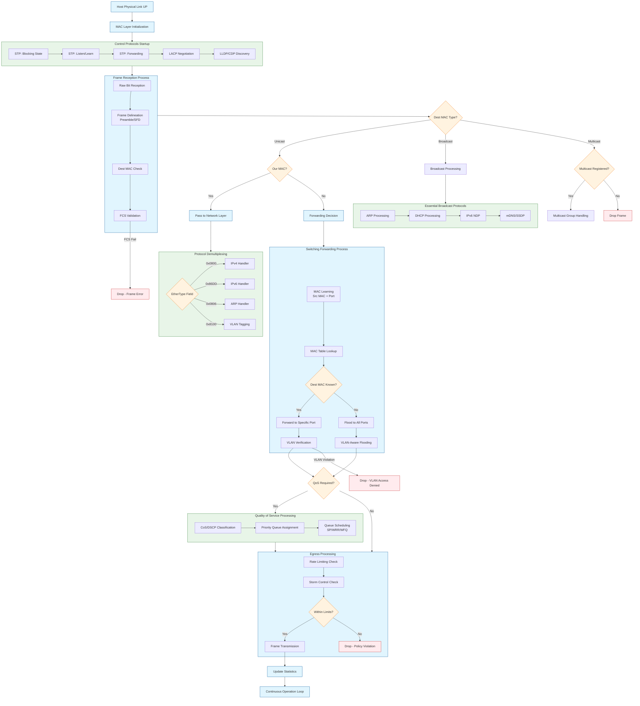

Here's the corrected and deeply detailed Mermaid diagram showing Layer 2 operations in chronological order:

## **Deep Technical Explanation of L2 Operations in Order:**

### **Phase 1: Physical & Data Link Initialization**
1. **Physical Link Establishment** (Auto-negotiation, link pulses)
2. **MAC Address Loading** (Burned-in address + fallback mechanisms)
3. **Network Interface Initialization** (Driver loading, buffer allocation)

### **Phase 2: Control Protocol Convergence**
4. **Spanning Tree Protocol** (STP States: Blocking → Listening → Learning → Forwarding)
5. **Link Aggregation** (LACP negotiation for port channels)
6. **Discovery Protocols** (LLDP/CDP neighbor information exchange)

### **Phase 3: Frame Reception & Validation**
7. **Physical Reception** (Bit synchronization, preamble detection)
8. **Frame Check Sequence** (CRC-32 validation for error detection)
9. **MAC Address Filtering** (Unicast/Broadcast/Multicast determination)

### **Phase 4: Frame Processing Logic**
10. **Protocol Demultiplexing** (EtherType-based protocol identification)
11. **VLAN Processing** (802.1Q tag handling, VLAN membership verification)
12. **Security Checks** (MAC security, port security, storm control)

### **Phase 5: Switching & Forwarding**
13. **MAC Learning** (Source address + ingress port mapping)
14. **Forwarding Decision** (Exact port match vs. flooding)
15. **Broadcast Domain Containment** (VLAN-based flooding scope)

### **Phase 6: Quality of Service**
16. **Classification** (CoS, DSCP, ACL-based)
17. **Queue Management** (Multiple egress queues per port)
18. **Scheduling** (Strict Priority, Weighted Round Robin algorithms)

### **Phase 7: Egress Processing**
19. **Rate Limiting** (Ingress/Egress policers)
20. **Storm Control** (Broadcast/Multicast/Unicast storm protection)
21. **Final Transmission** (Frame scheduling onto wire)

### **Phase 8: Maintenance & Monitoring**
22. **Counters & Statistics** (RMON, port counters, error tracking)
23. **Aging Processes** (MAC table entry timeout)
24. **Topology Updates** (Dynamic response to network changes)

## **Key L2 Protocols & Standards:**
- **MAC Addressing**: IEEE 802.3 (Ethernet)
- **VLANs**: IEEE 802.1Q
- **STP**: IEEE 802.1D
- **LACP**: IEEE 802.3ad
- **LLDP**: IEEE 802.1AB
- **QoS**: IEEE 802.1p

This sequence represents the complete lifecycle of a frame at Layer 2, from physical reception through processing to final transmission, including all critical decision points and protocol interactions.