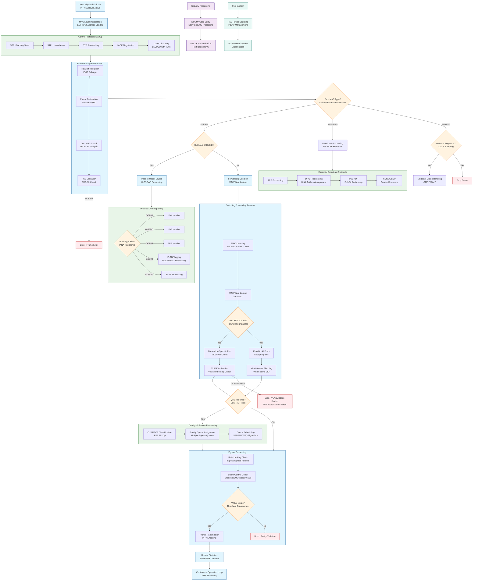

## **Enhanced Components Added:**

### **1. Physical Layer (PHY)**
- **PMD** (Physical Media Dependent): Actual media encoding
- **MAU** (Medium Attachment Unit): Transceiver functionality
- **MDI** (Media Dependent Interface): Physical connector interface

### **2. Addressing & Identification**
- **EUI-48/64** (Extended Unique Identifier): MAC address formats
- **BSSID** (Basic Service Set Identification): Wireless AP identification
- **OUI** (Organizationally Unique Identifier): Manufacturer prefix in MAC

### **3. Protocol Processing**
- **LLC** (Logical Link Control): Upper sublayer of L2
- **LSAP** (Link Service Access Point): Service access points
- **SNAP** (Subnetwork Access Protocol): Protocol encapsulation
- **EPD** (Ethertype Protocol Discrimination): Protocol identification

### **4. Discovery & Management**
- **LLDPDU** (LLDP Data Unit): Discovery protocol frames
- **TLV** (Type, Length, Value): Data encoding format
- **MIB** (Management Information Base): SNMP data structure
- **NMS** (Network Management System): Central management

### **5. Security Framework**
- **KaY** (Key Agreement Entity): MACsec key management
- **SecY** (Security Entity): MACsec enforcement
- **802.1X**: Port-based network access control

### **6. Power Systems**
- **PSE** (Power Sourcing Equipment): Switch/Injector side
- **PD** (Powered Device): Powered endpoint side

### **7. VLAN Advanced Concepts**
- **PVID** (Port VLAN ID): Default VLAN for untagged frames
- **PPVID** (Port and Protocol VLAN ID): Protocol-based VLAN assignment

<<<<<<< HEAD
### **8. Standards Bodies**
- **IANA** (Internet Assigned Numbers Authority): Ethertype assignments
- **IEEE** (Institute of Electrical and Electronics Engineers): Standards development
 
=======
### **Phase 8: Maintenance & Monitoring**
22. **Counters & Statistics** (RMON, port counters, error tracking)
23. **Aging Processes** (MAC table entry timeout)
24. **Topology Updates** (Dynamic response to network changes)

## **Key L2 Protocols & Standards:**
- **MAC Addressing**: IEEE 802.3 (Ethernet)
- **VLANs**: IEEE 802.1Q
- **STP**: IEEE 802.1D
- **LACP**: IEEE 802.3ad
- **LLDP**: IEEE 802.1AB
- **QoS**: IEEE 802.1p

This sequence represents the complete lifecycle of a frame at Layer 2, from physical reception through processing to final transmission, including all critical decision points and protocol interactions.
>>>>>>> ec1c315587d6dea9cdf0fe41d8a04e7bcf1b0263
